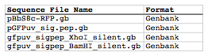
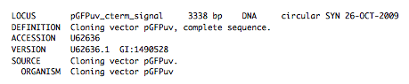

## SLIC, Gibson, CPEC assembly (and GeneArt® Seamless Cloning)

The following is a step-by-step example of how to use j5 to design a SLIC/Gibson/CPEC/SLiCE assembly. This example specifically addresses how to use a restriction enzyme linearized (digested) vector backbone, how to introduce point mutations (in this case to remove internal BglBrick sites), how a preliminary SOEing step may be used to assemble small DNA fragments before proceeding to SLIC/Gibson (CPEC/SLiCE does not require this preliminary step), and how a small part (such as a RBS) may be embedded within a primer. This example uses the stand alone simplified web interface for j5.

Here is a DeviceEditor .xml design file that you can use to quickly recapitulate the design described below in DeviceEditor [SLIC_Gibson_CPEC_example.xml](../../documents/SLIC_Gibson_CPEC_example.xml).

Here is an example assembly that we might like j5 to design for us with SLIC/Gibson/CPEC/SLiCE in mind:

We start with the vector pBbS8c-rfp, and linearize the vector backbone by EcoRI/XhoI digest.  For more information about the advantages and disadvantages of using a digest linearized vector backbone, please refer to the brief survey of j5 functionality. Using the vector pGFPuv_sig.pep as template, we will PCR amplify the gfpuv_sig.pep coding sequence, introducing two silent mutations in the process to remove internal XhoI and BamHI sites. The ribosomal binding site (RBS) found upstream of rfp in pBbS8c-rfp will be incorporated upstream of the gfpuv_sig.pep coding sequence (via embedding it in the forward primer oligo). These linearized vector backbone and PCR fragments will then be assembled together using SOE, then SLIC/Gibson, or alternatively CPEC/SLiCE, to yield the desired construct. Note that there are no BglBrick sites in the resulting assembly (we won't recreate the EcoRI and XhoI sites during the assembly process), because we want to use a large portion (extending beyond the gfpuv_sig.pep coding sequence) of this plasmid in another BglBrick for a downstream construction project.

#### Step 1 - Collect the genbank sequences (and create any new ones) for the assembly:

The first step is to collect all of the genbank sequence files from which we will derive the parts we want to assemble together. For the example above, we will be starting with the plasmids pBbS8c-rfp and pGFPuv_sig.pep. The genbank files for these two plasmids are:

pBbS8c-rfp ([pBbS8c-RFP.gb](http://j5.jbei.org/j5manual/attachments/pBbS8c-RFP.gb)):
pGFPuv_sig.pep ([pGFPuv_sig.pep.gb](http://j5.jbei.org/j5manual/attachments/pGFPuv_sig_pep.gb)):

The relevant portions of these plasmids are:

###### pBbS8c-rfp:
EcoRI/XhoI linearized pBbS8c-RFP backbone: bps 1933-1216 (wrapping around the beginning/end of the sequence, the EcoRI/XhoI recognition sites are included in their entireties)
RBS: bps 1226-1245

###### pGFPuv_sig.pep:
gfpuv_sig.pep: bps 289-1072

As noted above, and as described in the bioinformatics prerequisites section, we do not want any BglBrick sites in our resulting construct. We can use a sequence editor program such as the JBEI Registry Vector Editor, VectorNTI, ApE or Gentle to find any BglBrick sites (EcoRI, BglII, BamHI and XhoI) within the relevant portions of the pBbS8c-rfp and pGFPuv_sig.pep plasmids:

###### pBbS8c-rfp:
EcoRI: bps 1211-1216
XhoI: bps 1933-1938

###### pGFPuv_sig.pep:
XhoI: bps 709-714
BamHI: bps 808-813

So we will have to make silent mutations in the coding sequence of gfpuv_sig.pep to disrupt the XhoI and BamHI sites, as well as ensure that we don't recreate the EcoRI and XhoI sites used to generate the linearized vector backbone after assembly (we'll do this by effectively making bp deletions at the ends of their recognition sequences, see below). Since we would like to have the silent mutations made to the gfpuv_sig.pep coding sequence annotated in the resulting genbank file of the assembled sequence, we also need to create two additional genbank sequence files that contain only a bp each, the bp of their respective silent mutations, annotated with two features spanning this bp, namely the coding sequence of the gfpuv variant as well as the silent point mutation:

###### Silent mutations to introduce within pGFPuv_sig.pep:
XhoI: bps 709-714; silent mutation bp 714 g->a: ctcgag -> ctcgaA (LE -> LE):
gfpuv_sigpep_XhoI_silent ([gfpuv_sigpep_XhoI_silent.gb](http://j5.jbei.org/j5manual/attachments/gfpuv_sigpep_XhoI_sil.gb)):
BamHI: bps 808-813; silent mutation bp 813 c->t: ggatcc -> ggatcT (GS -> GS):
gfpuv_sigpep_BamHI_silent ([gfpuv_sigpep_BamHI_silent.gb](http://j5.jbei.org/j5manual/attachments/gfpuv_sigpep_BamHI_si.gb)):

#### Step 2 - Create the sequences list file and zipped sequences file:

Once we have all of the genbank files we need for the assembly, we need to create two input files for j5, the sequences list and zipped sequences files.  Using an existing sequences list file as a starting point (e.g. myseqlist.csv), we can use MS Excel, another spreadsheet program, or even a text editor, to create our sequences list CSV file (stylized for clarity, click to view larger version):

Here is the actual csv file: [myseqlist_pS8c-gfpuv_sig.pep.csv](http://j5.jbei.org/j5manual/attachments/myseqlist_pS8c-gfpuv_.csv)

Now, we make a zip file that contains all of the genbank sequence files: [myseqs_pS8c-gfpuv_sig.pep.zip](http://j5.jbei.org/j5manual/attachments/myseqs_pS8c-gfpuv_sig.zip)

#### Step 3 - Create the parts list file:

Now we need to define, in a parts list file, the DNA parts that we will assemble together. The first part to define is the linearized vector backbone. The relevant portion of the pBbS8c-rfp plasmid (as stated above) is bps 1933-1216. After cutting with EcoRI and XhoI, the 5' overhang of the cut EcoRI site extends only to bp 1215, and the 5' overhang of the cut XhoI site starts at bp 1934. Note that the last bp of the EcoRI recognition sequence and the first bp of the XhoI recognition sequence are not included in the linearized vector backbone. We define the part, pBbS8c-RFP_EcoRI_XhoI_vector_backbone, accordingly, with its part source, pBbS8c-rfp, start bp, 1934, and end bp, 1215. We are free to define the vector backbone in either orientation (reverse compliment or not); here we define it as not the reverse compliment. The resulting part definition for the linearized vector backbone is shown below.

The next part to define is the RBS. The relevant portion of the pBbS8c-rfp plasmid (as stated above) is bps 1226-1245. We define the part, RBS, accordingly, with its part source, pBbS8c-rfp, start bp, 1226, and end bp, 1245. In this case, the RBS sequence is on the top strand of pBbS8c-rfp, so it will be defined as not being the reverse complement. The resulting part definition for the RBS is shown below.

The next parts to define concern the gfpuv_sig.pep coding sequence containing the silent point mutations disrupting the internal XhoI and BamHI sites. We split up the gfpuv_sig.pep coding sequence into five parts: its 5' end, the XhoI silent mutation, its middle, the BamHI silent mutation, and its 3' end. The relevant portions of the pGFPuv_sig.pep plasmid (as stated above) are, for the 5' end (bps 289-713), the middle (bps 715-812), and the 3' end (bps 814-1072). The XhoI silent mutation (1 bp) is the entire gfpuv_sigpep_XhoI_silent sequence, and the BamHI silent mutation (1 bp) is the entire gfpuv_sigpep_BamHI_silent sequence. We define the five gfpuv_sig.pep parts, gfpuv_sigpep_5prime. gfpuv_sigpep_XhoI_silent, gfpuv_sigpep_middle, gfpuv_sigpep_BamHI_silent and gfpuv_sigpep_3prime, accordingly. In this case, the gfpuv_sig.pep coding sequence is on the top strand of pGFPuv_sig.pep, so all five of its parts will be defined as not being the reverse complements. The resulting parts definitions for the gfpuv_sig.pep coding sequence are shown below.

Using an existing parts list file as a starting point (e.g. partslist.csv), we can use MS Excel, another spreadsheet program, or even a text editor, to create our parts list file (stylized for clarity, click to view larger version):

Hereis the actual csv file: [partslist_pS8c-gfpuv_sig.pep.csv](http://j5.jbei.org/j5manual/attachments/partslist_pS8c-gfpuv_.csv)

It is absolutely crucial here to note that, as described in the parts list file documentation, the part source column refers to the sequence display ID within the sequence file (e.g. pGFPuv_cterm_signal), and not to the file name of the genbank sequence file itself (e.g. pGFPuv_sig.pep.gb). If you open up the genbank file pGFPuv_sig.pep.gb, presented above, with a text editor (e.g. notepad or TextEdit) the top of the file looks like (click to view a larger version):

The sequence display ID immediately follows the LOCUS, in this case it is pGFPuv_cterm_signal, and it is this sequence display ID that should be included in the parts list file, as we have done it above. Note that the same is true for the XhoI and BamHI silent mutation genbank files.

#### Step 4 - Create the target part ordering list file:

Now we need to define, in a target part ordering file, the order we would like the DNA parts defined above to be assembled in. For this particular assembly, we'll be assembling all of the parts in the same direction (forward). For more information about how to assemble in the reverse direction, please see the target part ordering file documentation. In addition, since this example assembly will use SLIC/Gibson/CPEC/SLiCE, the option to forcibly set a relative Golden Gate overhang position does not apply, and since we're not going after a combinatorial assembly, there is little justification for applying direct synthesis firewalls (for more information about forced relative overhang positions, and direct synthesis firewalls, refer to the target part ordering file documentation).

The first part in the order for this assembly is the linearized vector backbone. For this example assembly, it is especially important that the linearized vector backbone be placed first in the order (at the top of the list), because we will be linearizing the vector backbone with a restriction digest. In the current version of j5, only the first part in the target order may be derived from a digest. (If we were PCR amplifying the vector backbone, or having it directly synthesized, it wouldn't necessarily matter where in the target order it was located.) Since we defined the linearized vector backbone part above as being not in the reverse compliment direction, if we assemble it in the forward direction, we will end up with a vector backbone with the same orientation as that found in the pBbS8c-rfp plasmid. For the (restriction digest) linearized vector backbone, the forced assembly strategy field must be set to "DIGEST". The resulting target part ordering entry for the linearized vector backbone is shown below.

The next part in the order for this assembly is the RBS. We'll assemble the RBS in the forward direction so that it points to the gfpuv_sig.pep coding sequence that follows. As stated above, we do not want the EcoRI site used to restriction digest linearize the vector backbone to be reformed during the assembly process. Since the EcoRI digest cleaves off the final bp ("C") of the recognition sequence (the entire recognition sequence "GAATTC" spans from bp 1211 to 1216 in pBbS8c-rfp, but the linearized vector backbone only extends to bp 1215, see the parts list file above), we need to make sure that the first bp of the RBS is not "C", or else we would be regenerating the EcoRI recognition sequence in the assembled product. As it turns out, the first bp in the RBS sequence (bp 1226 in pBbS8c-rfp) is "T". (If the first bp in the RBS sequence were actually a "C", we would need to insert a non-"C" bp between the linearized vector backbone and the RBS, or make a non-"C" point mutation to the first bp of the RBS, to disrupt the EcoRI recognition sequence. Conversely, if instead we had actually wanted to recreate the EcoRI recognition site in the assembled product, we would have added a "C" bp insertion between the linearized vector backbone and the RBS, or made a "C" point mutation to the first bp of the RBS, to complete the EcoRI recognition sequence.) Note that upon inspecting the genbank file of the assembled product (which is automatically generated by j5) with a sequence viewer like the JBEI Registry Vector Editor, VectorNTI, ApE or Gentle, we would have immediately seen if we had unintentionally regenerated the EcoRI site. The resulting target part ordering entry for the RBS is shown below.

The next parts in the order for this assembly concern the gfpuv_sig.pep coding sequence containing the silent point mutations disrupting the internal XhoI and BamHI sites. We'll assemble all of the gpfuv_sig.pep coding sequence related parts in the forward direction. As stated above, we do not want the XhoI site used to restriction digest linearize the vector backbone to be reformed during the assembly process. Since the XhoI digest cleaves off the first bp ("C") of the recognition sequence (the entire recognition sequence "CTCGAG" spans from bp 1933 to 1938 in pBbS8c-rfp, but the linearized vector backbone only starts at bp 1934, see the parts list file above), we need to make sure that the last bp of the gfpuv_sig.pep coding sequence is not "C", or else we would be regenerating the XhoI recognition sequence in the assembled product. As it turns out, the last bp in the gfpuv_sig.pep coding sequence (bp 1072 in pGFPuv_sig.pep) is "A". The resulting target part ordering entries for the gfpuv_sig.pep coding sequence are shown below.

Using an existing target part ordering list file as a starting point (e.g. targetpartorderlist.csv), we can use MS Excel, another spreadsheet program, or even a text editor, to create our target part ordering list file (stylized for clarity, click to view larger version):

Here is the actual csv file: [targetpartorderlist_pS8c-gfpuv_sig.pep.csv](http://j5.jbei.org/j5manual/attachments/targetpartorderlist_p.csv)

#### Step 5 - Create the Eugene rules list file:

Now we need to define, in a Eugene rules list file, a list of design rules that j5 will check prior to designing the assembly. For this particular assembly, we won't need to define any special rules. For more information about how and when enforce Eugene design specification rules, please see the Eugene rules list file documentation.

Since we don't need any Eugene rules for this assembly, we'll just use an effectively empty rules list: [myeugenerules.eug](http://j5.jbei.org/j5manual/attachments/myeugenerules.eug) 

#### Step 6- Collect the master plasmids list, master oligos list, and master direct syntheses list files (or create new ones) for the assembly:

If you have already used j5, you should already have your own master plasmids, oligos, and direct syntheses list files (they would have been contained within the j5 results zip file you last downloaded; alternatively you can just "Re-use last updated" on the j5 SLIC/Gibson/CPEC/SLiCE assembly design web page entry form, see below).

If you're new to j5, you can easily create new (blank/empty) versions of these files. To do this, download the following three template input files:

  - Master plasmids list file: [j5_plasmids_0.csv](http://j5.jbei.org/j5manual/attachments/j5_plasmids_0.csv)
  - Master oligos list file: [j5_oligos_0.csv](http://j5.jbei.org/j5manual/attachments/j5_oligos_0.csv)
  - Master direct syntheses list file: [j5_directsyntheses_0.csv](http://j5.jbei.org/j5manual/attachments/j5_directsyntheses_0.csv)

Since j5 will use the first three characters of the file names when naming the designed plasmids, oligos, and direct synthesis pieces, it would probably be preferable for you to rename these files, replacing the first three characters (e.g. "j5_") with your initials (e.g. "NJH") or another three characters of your choosing. Also, you could easily do without the "_0" at the end of the file names, so you could chop that off while you are at it. If you are new to j5 but you want to start numbering your plasmids at a certain number (e.g. start at "pNJH00099" instead of the default "pNJH00001"), if you'd like to provide j5 the opportunity to re-use oligos that you already have, or you are interested in other related options, please see the master plasmids list, master oligos list, and master direct syntheses list file documentation for more information.

#### Step 7- Make any modifications to the j5 assembly parameters that you require:

For the majority of assemblies (such as this particular example), the default values for the j5 assembly parameters are perfectly fine. If you would like to optimize the design for GeneArt® Seamless Cloning, you will want to consider reducing the parameter for the minimum Gibson overlap length to 14bp, and the parameters for minimum and maximum desired Gibson overlap Tms to about 35 and 40ºC, respectively. You will also want to reduce the minimum Tm for detecting mispriming events down to 35ºC, so as to identify assembly piece incompatibilities at the room temperature assembly reaction condition.

Another important reason to modify the j5 assembly parameters is if you would like to construct a linear, rather than a circular piece of DNA.

If you would like to make modifications, download the following template input file:

j5 parameters file: [j5_parameters.csv](http://j5.jbei.org/j5manual/attachments/j5_parameters.csv)

You can use MS Excel, another spreadsheet program, or even a text editor, to modify the j5 parameters, as you see fit. See the j5 parameters file documentation for more information.

#### Step 8 - Use j5 to design the SLIC/Gibson/CPEC/SLiCE assembly:

Follow the directions on the stand alone simplified web interface documentation page for using j5 to design a SLIC/Gibson/CPEC/SLiCE assembly. For the purposes of this example, the input files you will upload are (assuming the default j5 assembly parameters and empty/blank master plasmids, oligos, and direct syntheses lists; note that following the directions above you likely have renamed the master plasmids, oligos, and direct syntheses lists file names with your own initials instead of "j5_"):

  - j5 parameters file: [j5_parameters.csv](http://j5.jbei.org/j5manual/attachments/j5_parameters.csv) 
  - Sequences list file: [myseqlist_pS8c-gfpuv_sig.pep.csv](http://j5.jbei.org/j5manual/attachments/myseqlist_pS8c-gfpuv_0.csv) 
  - Zipped sequences file: [myseqs_pS8c-gfpuv_sig.pep.zip](http://j5.jbei.org/j5manual/attachments/myseqs_pS8c-gfpuv_sig0.zip) 
  - Parts list file: [partslist_pS8c-gfpuv_sig.pep.csv](http://j5.jbei.org/j5manual/attachments/partslist_pS8c-gfpuv_0.csv)
  - Target part order list file: [targetpartorderlist_pS8c-gfpuv_sig.pep.csv](http://j5.jbei.org/j5manual/attachments/targetpartorderlist_p2.csv)
  - Eugene rules list file: [myeugenerules.eug](http://j5.jbei.org/j5manual/attachments/myeugenerules.eug)
  - Master plasmids list file: [j5_plasmids_0.csv](http://j5.jbei.org/j5manual/attachments/j5_plasmids_0.csv)
  - Master oligos list file: [j5_oligos_0.csv](http://j5.jbei.org/j5manual/attachments/j5_oligos_0.csv)
  - Master direct syntheses list file: [j5_directsyntheses_0.csv](http://j5.jbei.org/j5manual/attachments/j5_directsyntheses_0.csv)

If you have used j5 previously, you will have the option to "Re-use last updated" master plasmids, oligos, and direct syntheses lists files, as described in the stand alone simplified web interface documentation, if you so wish.

Here is a representative zip file resulting from this particular SLIC/Gibson/CPEC/SLiCE example: [j5_J5_20120106173226.zip](http://j5.jbei.org/j5manual/attachments/j5_J5_20120106173226.zip)

#### Step 9 - Check to make sure that the resulting assembled plasmid is really what you wanted:

Unzip the j5 zipped results file, and open the assembled DNA sequence file with a vector editor such as the JBEI Registry Vector Editor, VectorNTI, ApE or Gentle.
For this particular example (using the identical input files as listed above), the assembled DNA sequence file is: [pj5_00001.gb](http://j5.jbei.org/j5manual/attachments/pj5_00001.gb)

Here is the plasmid map of the assembled DNA sequence:

Note that ths plasmid map matches our design scheme (see the very top of this page), and that there are no XhoI or BamHI (or EcoRI or BglII) sites in the vector, so we are good to go for our downstream processes.

#### Step 10 - Check the resulting j5 assembly file for any primer design warning messages, assembly piece incompatibilities, or other warning messages:

Open the j5 assembly file with a spreadsheet program such as Excel or OpenOffice, and check for any likely mis-priming events or other sequence characteristics that will likely lead to PCR or assembly problems. The possible warning messages are described in the j5 SLIC/Gibson/CPEC/SLiCE assembly output file documentation. If there will likely be PCR or assembly problems given the current assembly design, it would be advised to use the information provided by j5 to guide you in developing a refined design strategy to mitigate the problems, and/or to select SLIC, Gibson, CPEC or SLiCE preferentially for the assembly (for example, if one of the assembly piece termini mis-primes an internal portion of an assembly piece, CPEC would not be preferred; see the SLIC/Gibson/CPEC/SLiCE documentation for more information).
For this particular example (using the identical input files as listed above), the j5 assembly output file is: [pj5_00001.csv](http://j5.jbei.org/j5manual/attachments/pj5_00001.csv)

For the example assembly described above, there are no likely mis-priming events or assembly piece incompatibilities, but there are several primer design warning messages, such as not being able to satisfy the minimum primer Tm constraint for several of the primers. These warning messages are useful troubleshooting starting points if the designed PCR reactions do not perform as well as expected, but in most cases they should not be considered show-stoppers.

As discussed in the Bioinformatics/BioCAD prerequisites section, it is important when pursuing SLIC/Gibson/CPEC/SLiCE assembly to check for very stable secondary structures at assembly piece termini with software similar to that provided by the DINAMelt Quikfold server. Checking the full length j5-designed primers for stable secondary structure is sufficient for these purposes.

For the example assembly described above, the 5' terminus of the assembly piece containing the 3' section of gfpuv_sig.pep (ACATTGAAGATGGATCTGTTCAACTAGCAGACCATTATCAACAAAATACTCCA, equivalent to the sequence of the designed full-length oligo j5_00010_(gfpuv_sigpep_3prime)_forward) has a pretty bad hairpin with a predicted Tm of 53.6 °C:

Since there are no mis-priming events, CPEC would likely be the preferred assembly methodology, since even the standard annealing step temperature within the CPEC protocol (55 °C) is greater than the estimated Tm of the hairpin.

#### Step 11 - Order the designed direct DNA synthesis fragments and DNA oligos, and perform the assembly:

That's it!