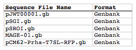
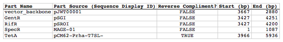
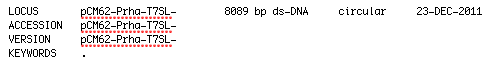
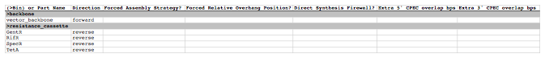
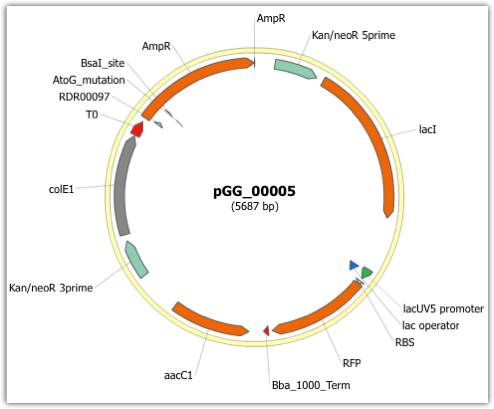

## Combinatorial SLIC, Gibson, CPEC assembly

The following is a step-by-step example of how to use j5 to design a combinatorial SLIC/Gibson/CPEC/SLiCE assembly. This example uses the stand alone simplified web interface for j5.

Here is a DeviceEditor .xml design file that you can use to quickly recapitulate the design described below in DeviceEditor (Combinatorial_SLIC_Gibson_CPEC_example.xml, right click and save link as to save the design file to disk): ]

Here is an example assembly that we might like j5 to design for us with combinatorial SLIC/Gibson/CPEC/SLiCE in mind:

For this particular combinatorial assembly, we want to replace the camR resistance gene in plasmid pJWT00001 with either gentR, rifR, specR, or tetA/tetR. We start with the vector pJWT00001 as the template for PCR. We'll linearize the pJWT00001 vector with PCR, introducing in the process SLIC/Gibson/CPEC/SLiCE overlaps. We'll similarly amplify the resistance gene portions of pSGI, pSROI, MAGE-01, or pCM62-Prha-T7SL (for 4 variants total). These five PCR products will then be combinatorially assembled with the SLIC/Gibson/CPEC/SLiCE methodologies to yield 4 plasmid variants total. 

#### Step 1 - Collect the genbank sequences (and create any new ones) for the assembly:

The first step is to collect all of the genbank sequence files from which we will derive the parts we want to assemble together. For the example above, we will be starting with the plasmid pS8c-gfpuv_sig.pep and the sequences that encode the signaling peptides and linkers (BMC_nterm_sig_pep_GFPuv and ccmN_nterm_sig_pep_GFPuv) and ssrA degradation tags (ssrA_tag_GFPuv and ssrA_tag_enhanced_GFPuv). The genbank files for these sequences are:

  - pJWT00001: [pJWT00001.gb](http://j5.jbei.org/j5manual/attachments/pJWT00001.gb)
  - pSGI: [pSGI.gb](http://j5.jbei.org/j5manual/attachments/pSGI.gb)
  - pSROI [pSROI.gb](http://j5.jbei.org/j5manual/attachments/pSROI.gb)
  - MAGE-01: [MAGE-01.gb](http://j5.jbei.org/j5manual/attachments/MAGE-010.gb)
  - pCM62-Prha-T7SL: [pCM62-Prha-T7SL-RFP.gb](http://j5.jbei.org/j5manual/attachments/pCM62-Prha-T7SL-RFP.gb)

The relevant portions of these sequences are:

###### pJWT00001:
Linearized pJWT00001 backbone: bps 3667-2880 (wrapping around the beginning/end of the sequence).

###### pSGI:
gentR cassette: bps 3427-4251

###### pSROI:
rifR cassette: bps 3427-4200

###### MAGE-01:
specR cassette: bps 1-1087

###### pCM62-Prha-T7SL:
tetA/tetR cassette: bps 3966-5936 (reverse complement)

#### Step 2 - Create the sequences list file and zipped sequences file:

Once we have all of the genbank files we need for the assembly, we need to create two input files for j5, the sequences list and zipped sequences files.  Using an existing sequences list file as a starting point (e.g. myseqlist.csv), we can use MS Excel, another spreadsheet program, or even a text editor, to create our sequences list CSV file (stylized for clarity, click to view larger version):

Here is the actual csv file: [seqListFile.csv](http://j5.jbei.org/j5manual/attachments/seqListFile0.csv)

Now, we make a zip file that contains all of the genbank sequence files: [sequences.zip](http://j5.jbei.org/j5manual/attachments/sequences0.zip)

#### Step 3 - Create the parts list file:

Now we need to define, in a parts list file, the DNA parts that we will assemble together. The first part to define is the linearized vector backbone. The relevant portion of the pJWT0001 plasmid (as stated above) is bps 3667-2880. We define the part, vector_backbone, accordingly, with its part source, pJWT0001, start bp, 3667, and end bp, 2880. Here we define the vector backbone as not the reverse compliment. The resulting part definition for the linearized vector backbone is shown below.

The next part to define is the gentR cassette. The relevant portion of the pSGI sequence (as stated above) is bps 3427-4251. We define the part, GentR, accordingly, with its part source, pSGI, start bp, 3427, and end bp, 4251. In this case, the gentR cassette sequence is on the top strand of pSGI, so it will be defined as not being the reverse complement. The resulting part definition for GentR is shown below.

The next part to define is the rifR cassette. The relevant portion of the pSROI sequence (as stated above) is bps 3427-4200. We define the part, RifR, accordingly, with its part source, pSROI, start bp, 3427, and end bp, 4200. In this case, the rifR cassette sequence is on the top strand of pSROI, so it will be defined as not being the reverse complement. The resulting part definition for RifR is shown below.

The next part to define is the specR cassette. The relevant portion of the MAGE-01 sequence (as stated above) is bps 1-1087. We define the part, SpecR, accordingly, with its part source, MAGE-01, start bp, 1, and end bp, 1087. In this case, the specR cassette sequence is on the top strand of MAGE-01, so it will be defined as not being the reverse complement. The resulting part definition for SpecR is shown below.

The final part to define is the tetA/tetR cassette. The relevant portion of the pCM62-Prha-T7SL sequence (as stated above) is bps 3966-5936. We define the part, TetA, accordingly, with its part source, pCM62-Prha-T7SL-, start bp, 3966, and end bp, 5936. In this case, the tetA/tetR cassette sequence is on the bottom strand of pCM62-Prha-T7SL, so it will be defined as being the reverse complement. The resulting part definition for TetA is shown below.

Using an existing parts list file as a starting point (e.g. partslist.csv), we can use MS Excel, another spreadsheet program, or even a text editor, to create our parts list file (stylized for clarity, click to view larger version):

Here is the actual csv file: [partListFile.csv](http://j5.jbei.org/j5manual/attachments/partListFile0.csv)

It is absolutely crucial here to note that, as described in the parts list file documentation, the part source column refers to the sequence display ID within the sequence file (e.g. pCM62-Prha-T7SL-), and not to the file name of the genbank sequence file itself (e.g. pCM62-Prha-T7SL-RFP.gb). If you open up the genbank file pCM62-Prha-T7SL-RFP.gb, presented above, with a text editor (e.g. notepad or TextEdit) the top of the file looks like (click to view a larger version):

The sequence display ID immediately follows the LOCUS, in this case it is pCM62-Prha-T7SL-, and it is this sequence display ID that should be included in the parts list file, as we have done it above.

#### Step 4 - Create the target part ordering list file:

Now we need to define, in a target part ordering file, the order and combinations we would like the DNA parts defined above to be assembled in. For this particular assembly, we'll be assembling the vector backbone in the forward direction and all of the resistance genes parts in the reverse direction. This example will not forcibly set relative overlap positions. We will allow j5 to identify an optimal set of overlaps for the collective set of combinations, and then j5 will enforce those overlap selections when assembling each given construct. 

The first combinatorial bin for this assembly contains the linearized vector backbone (the backbone bin, which contains only one part, the vector_backbone). Since we defined the pJWT00001 vector backbone part above as being not in the reverse compliment direction, if we assemble it in the forward direction, we will end up with a vector backbone with the same orientation as that found in the pJWT00001 plasmid. The resulting target bin and part ordering entries for the linearized vector backbone are shown below (for more information about the formatting of combinatorial target part ordering list files, see the target part ordering file documentation).

The next combinatorial bin for this assembly contains the resistance genes (the resistance_cassette bin, which contains four variants, the GentR, RifR, SpecR and TetA parts). We'll assemble these in the reverse direction. The resulting target bin and part ordering entries for the resistance genes are shown below.

Using an existing target part ordering list file as a starting point (e.g. targetpartorderlist.csv), we can use MS Excel, another spreadsheet program, or even a text editor, to create our target part ordering list file (stylized for clarity, click to view larger version):

Here is the actual csv file: [targetListFile.csv](http://j5.jbei.org/j5manual/attachments/targetListFile0.csv)

#### Step 5 - Create the Eugene rules list file:

Now we need to define, in a Eugene rules list file, a list of design rules that j5 will check prior to designing the combinatorial assembly. For this particular assembly, we won't need to define any special rules. For more information about how and when enforce Eugene design specification rules, please see the Eugene rules list file documentation.

Since we don't need any Eugene rules for this assembly, we'll just use an effectively empty rules list: [myeugenerules.eug](http://j5.jbei.org/j5manual/attachments/myeugenerules1.eug)

#### Step 6 - Collect the master plasmids list, master oligos list, and master direct syntheses list files (or create new ones) for the assembly:

If you have already used j5, you should already have your own master plasmids, oligos, and direct syntheses list files (they would have been contained within the j5 results zip file you last downloaded; alternatively you can just "Re-use last updated" on the j5 Combinatorial SLIC/Gibson/CPEC/SLiCE assembly design web page entry form, see below).

If you're new to j5, you can easily create new (blank/empty) versions of these files. To do this, download the following three template input files:

  - Master plasmids list file ([j5_plasmids_0.csv](http://j5.jbei.org/j5manual/attachments/j5_plasmids_00.csv))
  - Master oligos list file ([j5_oligos_0.csv](http://j5.jbei.org/j5manual/attachments/j5_oligos_00.csv))
  - Master direct syntheses list file ([j5_directsyntheses_0.csv](http://j5.jbei.org/j5manual/attachments/j5_directsyntheses_00.csv))

Since j5 will use the first three characters of the file names when naming the designed plasmids, oligos, and direct synthesis pieces, it would probably be preferable for you to rename these files, replacing the first three characters (e.g. "j5_") with your initials (e.g. "NJH") or another three characters of your choosing. Also, you could easily do without the "_0" at the end of the file names, so you could chop that off while you are at it. If you are new to j5 but you want to start numbering your plasmids at a certain number (e.g. start at "pNJH00099" instead of the default "pNJH00001"), if you'd like to provide j5 the opportunity to re-use oligos that you already have, or you are interested in other related options, please see the master plasmids list, master oligos list, and master direct syntheses list file documentation for more information.

#### Step 7 - Make any modifications to the j5 assembly parameters that you require:

For the majority of assemblies the default values for the j5 assembly parameters are perfectly fine.

An important reason to modify the j5 assembly parameters is if you would like to construct a linear, rather than a circular piece of DNA.

If you would like to make modifications, download the following template input file:

j5 parameters file: [j5_parameters.csv](http://j5.jbei.org/j5manual/attachments/j5_parameters.csv)

You can use MS Excel, another spreadsheet program, or even a text editor, to modify the j5 parameters, as you see fit. See the j5 parameters file documentation for more information.

#### Step 8 - Use j5 to design the combinatorial SLIC/Gibson/CPEC/SLiCE assembly:

Follow the directions on the stand alone simplified web interface documentation page for using j5 to design a combinatorial SLIC/Gibson/CPEC/SLiCE assembly. For the purposes of this example, the input files you will upload are (assuming the default j5 assembly parameters and the "GG_" master plasmids, oligos, and direct syntheses lists below with the n   ext plasmid to be "pGG_00005):

  - j5 parameters file: [j5_parameters.csv](http://j5.jbei.org/j5manual/attachments/j5_parameters.csv) 
  - Sequences list file: [seqListFile.csv](http://j5.jbei.org/j5manual/attachments/seqListFile.csv)
  - Zipped sequences file: [sequences.zip](http://j5.jbei.org/j5manual/attachments/sequences.zip)
  - Parts list file: [partListFile.csv](http://j5.jbei.org/j5manual/attachments/partListFile.csv)
  - Target part order list file: [targetListFile.csv](http://j5.jbei.org/j5manual/attachments/targetListFile.csv)
  - Eugene rules list file: [myeugenerules.eug](http://j5.jbei.org/j5manual/attachments/myeugenerules0.eug)
  - Master plasmids list file: [GG_plasmids_5.csv](http://j5.jbei.org/j5manual/attachments/GG_plasmids_50.csv)
  - Master oligos list file: [GG_oligos_0.csv](http://j5.jbei.org/j5manual/attachments/GG_oligos_00.csv)
  - Master direct syntheses list file: [GG_directsyntheses_0.csv](http://j5.jbei.org/j5manual/attachments/GG_directsyntheses_00.csv)

If you have used j5 previously, you will have the option to "Re-use last updated" master plasmids, oligos, and direct syntheses lists files, as described in the stand alone simplified web interface documentation, if you so wish.

Here is a representative zip file resulting from this particular combinatorial SLIC/Gibson/CPEC/SLiCE example: [j5_Njhillson_20120312124054.zip](http://j5.jbei.org/j5manual/attachments/j5_Njhillson_20120312.zip)

#### Step 9 - Check to make sure that the resulting assembled plasmids are really what you wanted:

Unzip the j5 zipped results file, and open the assembled DNA sequence files with a vector editor such as the JBEI Registry Vector Editor, VectorNTI, ApE or Gentle.

For this particular example (using the identical input files as listed above), the assembled DNA sequence file for the first plasmid combination is: [pGG_00005.gb](http://j5.jbei.org/j5manual/attachments/pGG_00005.gb)

Here is the plasmid map of the assembled DNA sequence for the first plasmid combination:

Note that this plasmid map matches our design scheme for the first plasmid combination (see the very top of this page).

The plasmid maps of the remaining 3 plasmid combinations will not be presented here, but the respective genbank sequence files are available within the output zip file provided above.

#### Step 10 - Check the resulting combinatorial j5 assembly file, as well as each of the individual plasmid j5 assembly files for any primer design or other warning messages:

For combinatorial SLIC/Gibson/CPEC/SLiCE assemblies, opening the combinatorial j5 assembly file with a spreadsheet program such as Excel or OpenOffice provides a quick glance at all of the oligos, PCR reactions, and assembly combinations that will be required to construct the entire set of plasmid combinations (see the combinatorial SLIC/Gibson/CPEC/SLiCE documentation for more information). This combinatorial assembly file can confirm that the oligos to be ordered and PCR products to be amplified will be maximally re-used in a cost-savings combinatorial fashion.

For this particular example (using the identical input files as listed above), the j5 combinatorial assembly output file is: [pGG_00005_combinatorial.csv](http://j5.jbei.org/j5manual/attachments/pGG_00005_combinatori.csv)

For this particular example, the PCR products are combinatorially re-used, as desired and depicted at the very top of this page (there is one vector backbone variant and four resistance gene variants, which are assembled into 4 total different plasmids).

Now, open each of the individual plasmid j5 assembly files with a spreadsheet program such as Excel or OpenOffice, and check for any likely mis-priming events or other sequence characteristics that will likely lead to PCR or assembly problems.  If there will likely be PCR or assembly problems given the current assembly design, it would be advised to use the information provided by j5 to guide you in developing a refined design strategy to mitigate the problems. The possible warning messages are described in the j5 SLIC/Gibson/CPEC/SLiCE documentation.

For this particular example (using the identical input files as listed above), the j5 assembly output file for the first plasmid combination is: [pGG_00005.csv](http://j5.jbei.org/j5manual/attachments/pGG_00005.csv)

For this particular example plasmid assembly, there are no likely mis-priming events or primer design warning messages. These warning messages are useful troubleshooting starting points if the designed PCR reactions do not perform as well as expected, but in most cases they should not be considered show-stoppers.

#### Step 11 - Order the designed direct DNA synthesis fragments and DNA oligos, and perform the assembly:

That's it!