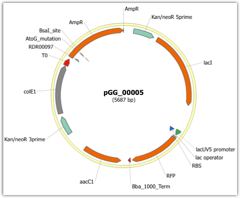

## Combinatorial Mock assembly

The following is a step-by-step example of how to use j5 to design a combinatorial mock assembly. This example is identical to the Combinatorial SLIC/Gibson/CPEC/SLiCE example, except here we are only asking j5 to output the anticipated products of the assembly reactions, and not to design the assembly protocols/processes. This example uses the stand alone simplified web interface for j5.

Here is a DeviceEditor .xml design file that you can use to quickly recapitulate the design described below in DeviceEditor: [Combinatorial_SLIC_Gibson_CPEC_example.xml](../../documents/Combinatorial_SLIC_Gi0.xml).

Here we are asking j5 to output the anticipated products of the following assembly reactions:

For this particular combinatorial assembly, we want to replace the camR resistance gene in plasmid pJWT00001 with either gentR, rifR, specR, or tetA/tetR; to yield 4 plasmid variants total. 

#### Steps 1 - 5

Identical to that found in the Combinatorial SLIC/Gibson/CPEC/SLiCE example.

#### Step 6 - Collect the master plasmids list file for the assembly:

If you have already used j5, you should already have your own master plasmids list file (it would have been contained within the j5 results zip file you last downloaded; alternatively you can just "Re-use last updated" on the j5 Mock assembly design web page entry form, see below).

If you're new to j5, you can easily create a new (blank/empty) version of this file. To do this, download the following template input file:
Master plasmids list file ([j5_plasmids_0.csv](http://j5.jbei.org/j5manual/attachments/j5_plasmids_03.csv))

Since j5 will use the first three characters of the file name when naming the designed plasmids, it would probably be preferable for you to rename this file, replacing the first three characters (e.g. "j5_") with your initials (e.g. "NJH") or another three characters of your choosing. Also, you could easily do without the "_0" at the end of the file names, so you could chop that off while you are at it. If you are new to j5 but you want to start numbering your plasmids at a certain number (e.g. start at "pNJH00099" instead of the default "pNJH00001"), please see the master plasmids list file documentation for more information.

#### Step 7- Make any modifications to the j5 assembly parameters that you require:

For the majority of assemblies (such as this particular example), the default values for the j5 assembly parameters are perfectly fine. One important reason to modify the j5 assembly parameters is if you would like to construct linear, rather than a circular pieces of DNA.

If you would like to make modifications, download the following template input file: j5 parameters file ([j5_parameters.csv](http://j5.jbei.org/j5manual/attachments/j5_parameters.csv))

You can use MS Excel, another spreadsheet program, or even a text editor, to modify the j5 parameters, as you see fit. See the j5 parameters file documentation for more information.

#### Step 8 - Use j5 to design the combinatorial Mock assembly:

Follow the directions on the stand alone simplified web interface documentation page for using j5 to design a combinatorial Mock assembly. For the purposes of this example, the input files you will upload are (assuming the default j5 assembly parameters and the "GG_" master plasmids, oligos, and direct syntheses lists below with the next plasmid to be "pGG_00005):

  - j5 parameters file: [j5_parameters.csv](http://j5.jbei.org/j5manual/attachments/j5_parameters.csv)
  - Sequences list file: [seqListFile.csv](http://j5.jbei.org/j5manual/attachments/seqListFile1.csv)
  - Zipped sequences file: [sequences.zip](http://j5.jbei.org/j5manual/attachments/sequences1.zip)
  - Parts list file: [partListFile.csv](http://j5.jbei.org/j5manual/attachments/partListFile1.csv)
  - Target part order list file: [targetListFile.csv](http://j5.jbei.org/j5manual/attachments/targetListFile1.csv)
  - Eugene rules list file: [myeugenerules.eug](http://j5.jbei.org/j5manual/attachments/myeugenerules3.eug)
  - Master plasmids list file: [GG_plasmids_5.csv](http://j5.jbei.org/j5manual/attachments/GG_plasmids_51.csv)

If you have used j5 previously, you will have the option to "Re-use last updated" master plasmids file, as described in the stand alone simplified web interface documentation, if you so wish.

Here is a representative zip file resulting from this particular combinatorial Mock example: [j5_njhillson_20120424132801.zip](http://j5.jbei.org/j5manual/attachments/j5_njhillson_201204240.zip)

#### Step 9 - Check to make sure that the resulting assembled plasmids are really what you wanted:

Unzip the j5 zipped results file, and open the assembled DNA sequence files with a vector editor such as the JBEI Registry Vector Editor, VectorNTI, ApE or Gentle.

For this particular example (using the identical input files as listed above), the assembled DNA sequence file for the first plasmid combination is: [pGG_00005.gb](http://j5.jbei.org/j5manual/attachments/pGG_000050.gb)

Here is the plasmid map of the assembled DNA sequence for the first plasmid combination:

Note that this plasmid map matches our design scheme for the first plasmid combination (see the very top of this page).

The plasmid maps of the remaining 3 plasmid combinations will not be presented here, but the respective genbank sequence files are available within the output zip file provided above.

That's it!