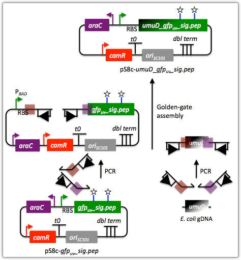
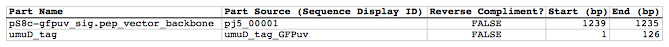
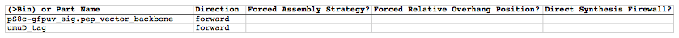
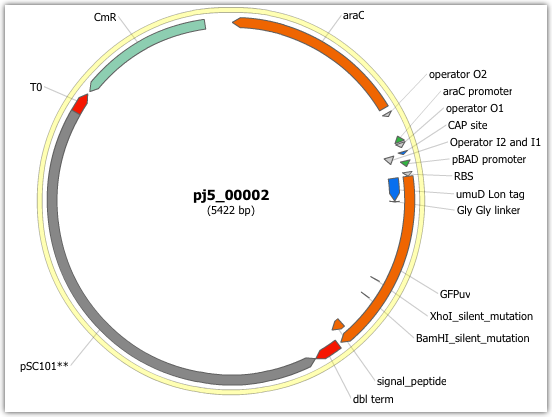

## Golden Gate assembly

The following is a step-by-step example of how to use j5 to design a Golden Gate assembly. This example specifically addresses how to use a PCR linearized vector backbone.

Here is a DeviceEditor .xml design file that you can use to quickly recapitulate the design described below in DeviceEditor: [Golden_Gate_example.xml](../../documents/Golden_Gate_example0.xml).

Here is an example assembly that we might like j5 to design for us with Golden Gate in mind:

For this particular assembly, we want to translationally fuse the N-terminus of UmuD to a GFP variant. As was the case for the previous SLIC/Gibson/CPEC/SLiCE example, we would like the BglBrick restriction sites (EcoRI, BglII, BamHI and XhoI) to be absent from the resulting plasmid. We start with the vector pS8c-gfpuv_sig.pep (this was constructed in the previous SLIC/Gibson/CPEC/SLiCE example) and E. coli genomic DNA as the templates for PCR. We'll linearize the pS8c-gfpuv_sig.pep vector with PCR, introducing the flanking BsaI sites and Golden Gate overhangs in the process, and similarly amplify the 5' coding portion of umuD. These two PCR products will then be assembled with the Golden Gate methodology.

#### Step 1 - Collect the genbank sequences (and create any new ones) for the assembly:

The first step is to collect all of the genbank sequence files from which we will derive the parts we want to assemble together. For the example above, we will be starting with the plasmid pS8c-gfpuv_sig.pep and (a fragment of) E. coli genomic DNA. The genbank files for these sequences are:

pS8c-gfpuv_sig.pep: [pj5_00001.gb](../../documents/pj5_000011.gb.txt)

umuD: [umuD_tag_GFPuv.gb](../../documents/umuD_tag_GFPuv.gb.txt)
(Note that the umuD sequence file has been pre-annotated for a translational fusion with the GFPuv variant.)

The relevant portions of these sequences are:

###### pS8c-gfpuv_sig.pep:
Linearized pS8c-gfpuv_sig.pep backbone: bps 1239-1235 (wrapping around the beginning/end of the sequence; the translational start "ATG" has been excluded (it will be provided by the umuD fragment)).

###### umuD:
UmuD N-terminus: bps 1-126

As noted above, and as described in the bioinformatics prerequisites section, we do not want any BglBrick sites in our resulting construct. We can use a sequence editor program such as the JBEI Registry Vector Editor, VectorNTI, ApE or Gentle to find any BglBrick sites (EcoRI, BglII, BamHI and XhoI) within the relevant portions of the above sequences:

###### pS8c-gfpuv_sig.pep:
None.

###### umuD:
None.

So, we will not have to make any (silent) mutations.

#### Step 2 - Create the sequences list file and zipped sequences file:

Once we have all of the genbank files we need for the assembly, we need to create two input files for j5, the sequences list and zipped sequences files.  Using an existing sequences list file as a starting point (e.g. myseqlist.csv), we can use MS Excel, another spreadsheet program, or even a text editor, to create our sequences list CSV file (stylized for clarity):

Here is the actual csv file: [myseqlist_pS8c-umuD_gfpuv_sig.pep.csv](../../documents/myseqlist_pS8c-umuD_g0.csv)

Now, we make a zip file that contains all of the genbank sequence file: [myseqs_pS8c-umuD_gfpuv_sig.pep.zip](../../documents/myseqs_pS8c-umuD_gfpu0.zip)

#### Step 3 - Create the parts list file:

Now we need to define, in a parts list file, the DNA parts that we will assemble together. The first part to define is the linearized vector backbone. The relevant portion of the pS8c-gfpuv_sig.pep plasmid (as stated above) is bps 1239-1235. We define the part, pS8c-gfpuv_sig.pep_vector_backbone, accordingly, with its part source, pj5_00001, start bp, 1239, and end bp, 1235. We are free to define the vector backbone in either orientation (reverse compliment or not); here we define it as not the reverse compliment. The resulting part definition for the linearized vector backbone is shown below.

The next part to define is the UmuD N-terminus. The relevant portion of the umuD sequence (as stated above) is bps 1-126. We define the part, umuD_tag, accordingly, with its part source, umuD_tag_GFPuv, start bp, 1, and end bp, 126. In this case, the umuD sequence is on the top strand of umuD_tag_GFPuv, so it will be defined as not being the reverse complement. The resulting part definition for the umuD_tag is shown below.

Using an existing parts list file as a starting point (e.g. partslist.csv), we can use MS Excel, another spreadsheet program, or even a text editor, to create our parts list file (stylized for clarity)

Here is the actual csv file: [partslist_pS8c-umuD_gfpuv_sig.pep.csv](../../documents/partslist_pS8c-umuD_g0.csv)

#### Step 4 - Create the target part ordering list file:

Now we need to define, in a target part ordering file, the order we would like the DNA parts defined above to be assembled in. For this particular assembly, we'll be assembling all of the parts in the same direction (forward). For more information about how to assemble in the reverse direction, please see the target part ordering file documentation. Although this example assembly will use Golden Gate, the option to forcibly set a relative Golden Gate overhang positions will not be taken here, since this assembly is not explicitly part of a larger combinatorial assembly project (for example, introducing a series of N-terminal tags upstream of GFPuv). For the same reason, there is little justification for applying direct synthesis firewalls (for more information about forced relative overhang positions, and direct synthesis firewalls, refer to the target part ordering file documentation).

The first part in the order for this assembly is the linearized vector backbone. Since we defined the linearized vector backbone part above as being not in the reverse compliment direction, if we assemble it in the forward direction, we will end up with a vector backbone with the same orientation as that found in the pS8c-gfpuv_sig.pep plasmid. The resulting target part ordering entry for the linearized vector backbone is shown below.

The next part in the order for this assembly is the UmuD N-terminus. We'll assemble the UmuD N-terminus in the forward direction for a translational fusion with the gfpuv_sig.pep coding sequence that follows. The resulting target part ordering entry for the UmuD N-terminus is shown below.

Using an existing target part ordering list file as a starting point (e.g. targetpartorderlist.csv), we can use MS Excel, another spreadsheet program, or even a text editor, to create our target part ordering list file (stylized for clarity):

Here is the actual csv file: [targetpartorderlist_pS8c-umuD_gfpuv_sig.pep.csv](../../documents/targetpartorderlist_p4.csv)

#### Step 5 - Create the Eugene rules list file:

Now we need to define, in a Eugene rules list file, a list of design rules that j5 will check prior to designing the assembly. For this particular assembly, we won't need to define any special rules. For more information about how and when enforce Eugene design specification rules, please see the Eugene rules list file documentation.

Since we don't need any Eugene rules for this assembly, we'll just use an effectively empty rules list: [myeugenerules.eug](../../documents/myeugenerules5.eug.txt)

#### Step 6 - Collect the master plasmids list, master oligos list, and master direct syntheses list files (or create new ones) for the assembly:

If you have already used j5, you should already have your own master plasmids, oligos, and direct syntheses list files (they would have been contained within the j5 results zip file you last downloaded; alternatively you can just "Re-use last updated" on the j5 Golden Gate assembly design web page entry form, see below).

If you're new to j5, you can easily create new (blank/empty) versions of these files. To do this, download the following three template input files:

  - Master plasmids list file: [j5_plasmids_0.csv](../../documents/j5_plasmids_04.csv)
  - Master oligos list file: [j5_oligos_0.csv](../../documents/j5_oligos_01.csv)
  - Master direct syntheses list file: [j5_directsyntheses_0.csv](../../documents/j5_directsyntheses_01.csv)

Since j5 will use the first three characters of the file names when naming the designed plasmids, oligos, and direct synthesis pieces, it would probably be preferable for you to rename these files, replacing the first three characters (e.g. "j5_") with your initials (e.g. "NJH") or another three characters of your choosing. Also, you could easily do without the "_0" at the end of the file names, so you could chop that off while you are at it. If you are new to j5 but you want to start numbering your plasmids at a certain number (e.g. start at "pNJH00099" instead of the default "pNJH00001"), if you'd like to provide j5 the opportunity to re-use oligos that you already have, or you are interested in other related options, please see the master plasmids list, master oligos list, and master direct syntheses list file documentation for more information.

#### Step 7 - Make any modifications to the j5 assembly parameters that you require:

For the majority of assemblies (such as this particular example, which uses BsaI as the Golden Gate type IIs endonuclease), the default values for the j5 assembly parameters are perfectly fine. If you would like to use a type IIs endonuclease other than BsaI, you will need to make at least two changes to the default j5 assembly parameters. For example, to change from BsaI to AarI:

Parameter:
GOLDENGATERECOGNITIONSEQ

Default (BsaI):
GGTCTC

Change to (for AarI):
CACCTGC

Parameter:
GOLDENGATETERMINIEXTRASEQ

Default (BsaI):
CACACCAGGTCTCA

Change to (for AarI):
CACCACACCTGCACCA

Since BsaI and AarI cleavage both result in 4 bp overhangs, it is not necessary to change the parameter GOLDENGATEOVERHANGBPS. However, if the type IIs endonuclease that you would like use results in overhangs longer or shorter than 4 bp, you will need to adjust that parameter accordingly as well.

Another important reason to modify the j5 assembly parameters is if you would like to construct a linear, rather than a circular piece of DNA.

If you would like to make modifications, download the following template input file:

j5 parameters file: [j5_parameters.csv](../../documents/j5_parameters.csv)

You can use MS Excel, another spreadsheet program, or even a text editor, to modify the j5 parameters, as you see fit. See the j5 parameters file documentation for more information.

#### Step 8 - Use j5 to design the Golden Gate assembly:

Follow the directions on the stand alone simplified web interface documentation page for using j5 to design a Golden Gate assembly. For the purposes of this example, the input files you will upload are (assuming the default j5 assembly parameters and the master plasmids, oligos, and direct syntheses lists that resulted from the previous SLIC/Gibson/CPEC/SLiCE example; note that following the directions above you likely have renamed the master plasmids, oligos, and direct syntheses lists file names with your own initials instead of "j5_"):

  - j5 parameters file: [j5_parameters.csv](../../documents/j5_parameters.csv) 
  - Sequences list file: [myseqlist_pS8c-umuD_gfpuv_sig.pep.csv](../../documents/myseqlist_pS8c-umuD_g.csv) 
  - Zipped sequences file: [myseqs_pS8c-umuD_gfpuv_sig.pep.zip](../../documents/myseqs_pS8c-umuD_gfpu.zip)
  - Parts list file: [partslist_pS8c-umuD_gfpuv_sig.pep.csv](../../documents/partslist_pS8c-umuD_g.csv)
  - Target part order list file: [targetpartorderlist_pS8c-umuD_gfpuv_sig.pep.csv](../../documents/targetpartorderlist_p0.csv)
  - Eugene rules list file: [myeugenerules.eug](../../documents/myeugenerules4.eug.txt)
  - Master plasmids list file: [j5_plasmids_1.csv](../../documents/j5_plasmids_10.csv)
  - Master oligos list file: [j5_oligos_1.csv](../../documents/j5_oligos_10.csv)
  - Master direct syntheses list file: [j5_directsyntheses_1.csv](../../documents/j5_directsyntheses_10.csv)

If you have used j5 previously, you will have the option to "Re-use last updated" master plasmids, oligos, and direct syntheses lists files, as described in the stand alone simplified web interface documentation, if you so wish.

Here is a representative zip file resulting from this particular Golden Gate example: [j5_J5_20100723135152.zip](../../documents/j5_J5_201007231351520.zip)

#### Step 9 - Check to make sure that the resulting assembled plasmid is really what you wanted:

Unzip the j5 zipped results file, and open the assembled DNA sequence file with a vector editor such as the JBEI Registry Vector Editor, VectorNTI, ApE or Gentle.
For this particular example (using the identical input files as listed above), the assembled DNA sequence file is: [pj5_00002.gb](../../documents/pj5_00002.gb.txt)

Here is the plasmid map of the assembled DNA sequence:

Note that this plasmid map matches our design scheme (see the very top of this page), and that there are no BglBrick restriction sites (EcoRI, BglII, BamHI and XhoI) in the vector, so we are good to go for our downstream processes.

#### Step 10 - Check the resulting j5 assembly file for any primer design or Golden Gate type IIs endonuclease restriction site or other warning messages:

The possible warning messages are described in the j5 Golden Gate assembly output file documentation.

Open the j5 assembly file with a spreadsheet program such as Excel or OpenOffice, and check for any likely mis-priming events or other sequence characteristics that will likely lead to PCR or assembly problems.  If there will likely be PCR or assembly problems given the current assembly design, it would be advised to use the information provided by j5 to guide you in developing a refined design strategy to mitigate the problems. Similarly, check for a warning message that details if any Golden Gate type IIs endonuclease recognition site sequences were found in the final assembled vector sequence, which could potentially drastically reduce the assembly efficiency.
For this particular example (using the identical input files as listed above), the j5 assembly output file is: [pj5_00002.csv](../../documents/pj5_00002.csv)

For the example assembly described above, there are no likely mis-priming events, but there are several primer design warning messages, such as not being able to satisfy the minimum primer Tm constraint for one of the primers. These warning messages are useful troubleshooting starting points if the designed PCR reactions do not perform as well as expected, but in most cases they should not be considered show-stoppers.

#### Step 11 - Order the designed direct DNA synthesis fragments and DNA oligos, and perform the assembly:

That's it!
