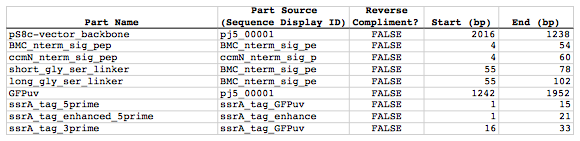
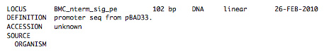

## Combinatorial Golden Gate assembly

The following is a step-by-step example of how to use j5 to design a combinatorial Golden Gate assembly. This example specifically addresses how to use direct synthesis firewalls. This example uses the stand alone simplified web interface for j5.

[Please refer to the "Running a combinatorial SLIC/Gibson/CPEC/SLiCE or Golden Gate DNA assembly design on the j5 server" section in the DeviceEditor user's manual for information concerning how the equivalent design process can be accomplished using DeviceEditor. Here is a DeviceEditor .xml design file that you can use to quickly recapitulate the design described below in DeviceEditor [Combinatorial_Golden_Gate_example.xml](http://j5.jbei.org/j5manual/attachments/Combinatorial_Golden_.xml)

Here is an example assembly that we might like j5 to design for us with combinatorial Golden Gate in mind:

For this particular combinatorial assembly, we want to translationally fuse one of two (BMC and ccmN) signaling peptides followed by one of two linkers (long and short) to a GFP variant followed by one of two ssrA degradation tags (standard and enhanced). As was the case for the previous SLIC/Gibson/CPEC/SLiCE example, we would like the BglBrick restriction sites (EcoRI, BglII, BamHI and XhoI) to be absent from the resulting plasmids. We start with the vector pS8c-gfpuv_sig.pep (this was constructed in the previous SLIC/Gibson/CPEC/SLiCE example) as the template for PCR. We'll linearize the pS8c-gfpuv_sig.pep vector with PCR, introducing in the process the signaling peptides (2 variants) and the constant 3' end of the ssrA tag, as well as the flanking BsaI sites and Golden Gate overhangs. We'll similarly amplify the gfpuv portion of gfpuv_sig.pep, in this case introducing the linkers and 5' ends of the ssrA tags (for 4 variants total). These six PCR products will then be combinatorially assembled with the Golden Gate methodology to yield 8 plasmid variants total. It should be noted that the two ssrA degradation tag variants were purposefully split into variable 5' regions and a constant 3' region to allow us to share the oligo-embedding burden between the forward (vector backbone amplification) and reverse (gfpuv amplification) primers. For this assembly, we will also be enforcing direct synthesis firewalls between the signal peptide and linker parts, as well as between the ssrA tag 5' and 3' parts (coincident with the Golden Gate junctions shown above). When considering the most cost-effective strategy for constructing only one of the 8 plasmids in this example (which is effectively what j5 does when designing the combinatorial "template" assembly, see the brief survey of j5 functionality for more information), it could be the case that directly synthesizing the entire sig.pep_linker_gfpuv_ssrA coding sequence would be less expensive than the oligos required for the PCR-based assembly shown above. However, when the cost of the oligos shown above is amortized over all of the 8 plasmids to be constructed, it is very unlikely that directly synthesizing each of the 8 sig.pep_linker_gfpuv_ssrA coding sequence combinations would be less expensive than the combinatorial PCR-based approach. The direct synthesis firewalls we will be enforcing ensure that we maximize the combinatorial cost savings.

#### Step 1 - Collect the genbank sequences (and create any new ones) for the assembly:

The first step is to collect all of the genbank sequence files from which we will derive the parts we want to assemble together. For the example above, we will be starting with the plasmid pS8c-gfpuv_sig.pep and the sequences that encode the signaling peptides and linkers (BMC_nterm_sig_pep_GFPuv and ccmN_nterm_sig_pep_GFPuv) and ssrA degradation tags (ssrA_tag_GFPuv and ssrA_tag_enhanced_GFPuv). The genbank files for these sequences are:

  - pS8c-gfpuv_sig.pep: [pj5_00001.gb](http://j5.jbei.org/j5manual/attachments/pj5_000012.gb)
  - BMC_nterm_sig_pep_GFPuv: [BMC_nterm_sig_pep_GFPuv.gb](http://j5.jbei.org/j5manual/attachments/BMC_nterm_sig_pep_GFP.gb)
  - ccmN_nterm_sig_pep_GFPuv: [ccmN_nterm_sig_pep_GFPuv.gb](http://j5.jbei.org/j5manual/attachments/ccmN_nterm_sig_pep_GF.gb)
  - ssrA_tag_GFPuv: [ssrA_tag_GFPuv.gb](http://j5.jbei.org/j5manual/attachments/ssrA_tag_GFPuv.gb)
  - ssrA_tag_enhanced_GFPuv: [ssrA_tag_enhanced_GFPuv.gb](http://j5.jbei.org/j5manual/attachments/ssrA_tag_enhanced_GFP.gb)

(Note that the signaling peptide and ssrA tag sequence files have been pre-annotated for translational fusions with the GFPuv variant.)

The relevant portions of these sequences are:

###### pS8c-gfpuv_sig.pep:
Linearized pS8c-gfpuv_sig.pep backbone: bps 2016-1238 (wrapping around the beginning/end of the sequence, includes the "ATG start and "TAA" stop codons).
gfpuv: bps 1242-1952

###### BMC_nterm_sig_pep_GFPuv:
BMC signal peptide: bps 4-54 (without the "ATG" start codon)
Short Gly/Ser linker: bps 55-78
Long Gly/Ser linker: bps 55-102

###### ccmN_nterm_sig_pep_GFPuv:
ccmN signal peptide: bps 4-60 (without the "ATG" start codon)

###### ssrA_tag_GFPuv:
ssrA tag 5': bps 1-15
ssrA tag 3': bps 16-33 (without the "TAA" stop codon)

###### ssrA_tag_enhanced_GFPuv:
ssrA tag 5' enhanced: bps 1-21

As noted above, and as described in the bioinformatics prerequisites section, we do not want any BglBrick sites in our resulting construct. We can use a sequence editor program such as the JBEI Registry Vector Editor, VectorNTI, ApE or Gentle to find any BglBrick sites (EcoRI, BglII, BamHI and XhoI) within the relevant portions of the above sequences:

###### pS8c-gfpuv_sig.pep:
None.

###### BMC_nterm_sig_pep_GFPuv:
None.

###### ccmN_nterm_sig_pep_GFPuv:
None.

###### ssrA_tag_GFPuv:
None.

###### ssrA_tag_enhanced_GFPuv:
None.

So, we will not have to make any (silent) mutations.

#### Step 2 - Create the sequences list file and zipped sequences file:

Once we have all of the genbank files we need for the assembly, we need to create two input files for j5, the sequences list and zipped sequences files.  Using an existing sequences list file as a starting point (e.g. myseqlist.csv), we can use MS Excel, another spreadsheet program, or even a text editor, to create our sequences list CSV file (stylized for clarity, click to view larger version):

Here is the actual csv file: [myseqlist_pS8c-sig.pep_linker_gfpuv_ssrA.csv](http://j5.jbei.org/j5manual/attachments/myseqlist_pS8c-sig_pe0.csv)

Now, we make a zip file that contains all of the genbank sequence files: [myseqs_pS8c-sig.pep_linker_gfpuv_ssrA.zip](http://j5.jbei.org/j5manual/attachments/myseqs_pS8c-sig_pep_l0.zip)

#### Step 3 - Create the parts list file:

Now we need to define, in a parts list file, the DNA parts that we will assemble together. The first part to define is the linearized vector backbone. The relevant portion of the pS8c-gfpuv_sig.pep plasmid (as stated above) is bps 2016-1238. We define the part, pS8c-vector_backbone, accordingly, with its part source, pj5_00001, start bp, 2016, and end bp, 1238. We are free to define the vector backbone in either orientation (reverse compliment or not); here we define it as not the reverse compliment. The resulting part definition for the linearized vector backbone is shown below.

The next part to define is the BMC signal peptide. The relevant portion of the BMC_nterm_sig_pep_GFPuv sequence (as stated above) is bps 4-54. We define the part, BMC_nterm_sig_pep, accordingly, with its part source, BMC_nterm_sig_pe, start bp, 4, and end bp, 54. In this case, the BMC signal peptide sequence is on the top strand of BMC_nterm_sig_pep_GFPuv, so it will be defined as not being the reverse complement. The resulting part definition for the BMC_nterm_sig_pep is shown below.

The next part to define is the ccmN signal peptide. The relevant portion of the ccmN_nterm_sig_pep_GFPuv sequence (as stated above) is bps 4-60. We define the part, ccmN_nterm_sig_pep, accordingly, with its part source, ccmN_nterm_sig_p, start bp, 4, and end bp, 60. In this case, the ccmN signal peptide sequence is on the top strand of ccmN_nterm_sig_pep_GFPuv, so it will be defined as not being the reverse complement. The resulting part definition for the ccmN_nterm_sig_pep is shown below.

The next part to define is the short linker. The relevant portion of the BMC_nterm_sig_pep_GFPuv sequence (as stated above) is bps 55-78. We define the part, short_gly_ser_linker, accordingly, with its part source, BMC_nterm_sig_pe, start bp, 55, and end bp, 78. In this case, the short linker sequence is on the top strand of BMC_nterm_sig_pep_GFPuv, so it will be defined as not being the reverse complement. The resulting part definition for the short_gly_ser_linker is shown below.

The next part to define is the long linker. The relevant portion of the BMC_nterm_sig_pep_GFPuv sequence (as stated above) is bps 55-102. We define the part, long_gly_ser_linker, accordingly, with its part source, BMC_nterm_sig_pe, start bp, 55, and end bp, 102. In this case, the long linker sequence is on the top strand of BMC_nterm_sig_pep_GFPuv, so it will be defined as not being the reverse complement. The resulting part definition for the long_gly_ser_linker is shown below.

The next part to define is the GFP variant. The relevant portion of the pS8c-gfpuv_sig.pep plasmid (as stated above) is bps 1242-1952. We define the part, GFPuv, accordingly, with its part source, pj5_00001, start bp, 1242, and end bp, 1952. In this case, the GFP variant sequence is on the top strand of the pS8c-gfpuv_sig.pep plasmid, so it will be defined as not being the reverse complement. The resulting part definition for GFPuv is shown below.

The next part to define is the 5' end of the standard ssrA tag. The relevant portion of ssrA_tag_GFPuv (as stated above) is bps 1-15. We define the part, ssrA_tag_5prime, accordingly, with its part source, ssrA_tag_GFPuv, start bp, 1, and end bp, 15. In this case, the 5' end of the standard ssrA tag sequence is on the top strand of ssrA_tag_GFPuv, so it will be defined as not being the reverse complement. The resulting part definition for the ssrA_tag_5prime is shown below.

The next part to define is the 5' end of the enhanced ssrA tag. The relevant portion of ssrA_tag_enhanced_GFPuv (as stated above) is bps 1-21. We define the part, ssrA_tag_enhanced_5prime, accordingly, with its part source, ssrA_tag_enhance, start bp, 1, and end bp, 21. In this case, the 5' end of the enhanced ssrA tag sequence is on the top strand of ssrA_tag_enhanced_GFPuv, so it will be defined as not being the reverse complement. The resulting part definition for the ssrA_tag_enhanced_5prime is shown below.

The final part to define is the 3' end of the ssrA tag. The relevant portion of ssrA_tag_GFPuv (as stated above) is bps 16-33. We define the part, ssrA_tag_3prime, accordingly, with its part source, ssrA_tag_GFPuv, start bp, 16, and end bp, 33. In this case, the 3' end of the ssrA tag sequence is on the top strand of ssrA_tag_GFPuv, so it will be defined as not being the reverse complement. The resulting part definition for the ssrA_tag_3prime is shown below.

Using an existing parts list file as a starting point (e.g. partslist.csv), we can use MS Excel, another spreadsheet program, or even a text editor, to create our parts list file (stylized for clarity, click to view larger version):

Here is the actual csv file (partslist_pS8c-sig.pep_linker_gfpuv_ssrA.csv):

It is absolutely crucial here to note that, as described in the parts list file documentation, the part source column refers to the sequence display ID within the sequence file (e.g. BMC_nterm_sig_pe), and not to the file name of the genbank sequence file itself (e.g. BMC_nterm_sig_pep_GFPuv.gb). If you open up the genbank file BMC_nterm_sig_pep_GFPuv.gb, presented above, with a text editor (e.g. notepad or TextEdit) the top of the file looks like (click to view a larger version):

The sequence display ID immediately follows the LOCUS, in this case it is BMC_nterm_sig_pe, and it is this sequence display ID that should be included in the parts list file, as we have done it above.

#### Step 4 - Create the target part ordering list file:

Now we need to define, in a target part ordering file, the order and combinations we would like the DNA parts defined above to be assembled in. For this particular assembly, we'll be assembling all of the parts in the same direction (forward). For more information about how to assemble in the reverse direction, please see the target part ordering file documentation. Although this example assembly will use Golden Gate, the option to forcibly set a relative Golden Gate overhang positions will not explicitly be taken here. We will allow j5 to identify an optimal set of overhangs for the collective set of combinations, and then j5 will enforce those overhang selections when assembling each given construct. However, we will apply direct synthesis firewalls between the signal peptide and linker parts, as well as between the ssrA tag 5' and 3' parts, as discussed above (for more information about forced relative overhang positions, and direct synthesis firewalls, refer to the target part ordering file documentation).

The first combinatorial bin for this assembly contains the linearized vector backbone (the vector_backbone bin, which contains only one part, the pS8c-vector_backbone). Since we defined the pS8c vector backbone part above as being not in the reverse compliment direction, if we assemble it in the forward direction, we will end up with a vector backbone with the same orientation as that found in the pS8c-gfpuv_sig.pep plasmid. The resulting target bin and part ordering entries for the linearized vector backbone are shown below (for more information about the formatting of combinatorial target part ordering list files, see the target part ordering file documentation).

The next combinatorial bin for this assembly contains the signal peptides (the nterm_sig_pep bin, which contains two variants, the BMC_nterm_sig_pep and ccmN_nterm_sig_pep parts). We'll assemble the signal peptides in the forward direction for a translational fusion with the gfpuv coding sequence that follows. Since we will be enforcing a direct synthesis firewall after the signal peptides, we will set the direct synthesis firewall to "TRUE" for this bin. The resulting target bin and part ordering entries for the signal peptides are shown below.

The next combinatorial bin for this assembly contains the linkers (the gly_ser_linker bin, which contains two variants, the long_gly_ser_linker and the short_gly_ser_linker parts). We'll assemble the linkers in the forward direction for a translational fusion with the gfpuv coding sequence that follows. The resulting target bin and part ordering entries for the linkers are shown below.

The next combinatorial bin for this assembly contains gfpuv (the GFPuv bin, which contains only one part, GFPuv). We'll assemble gfpuv in the forward direction. The resulting target bin and part ordering entries for gfpuv are shown below.

The next combinatorial bin for this assembly contains the 5' ssrA tags (the ssrA_tag_5prime bin, which contains two variants, the ssrA_tag_5prime and ssrA_tag_enhanced_5prime parts). We'll assemble the 5' ssrA tags in the forward direction for a translational fusion with the preceeding gfpuv coding sequence. In order to share the oligo-embedding burden between the forward (vector backbone amplification) and reverse (gfpuv amplification) primers, we will will force the assembly strategies for the 5' ssrA tags to be "Embed_in_primer_reverse" for this bin and for these parts. Since we will be enforcing a direct synthesis firewall after the 5' ssrA tags, we will set the direct synthesis firewall to "TRUE" for this bin. The resulting target bin and part ordering entries for the 5' ssrA tags are shown below.

The next combinatorial bin for this assembly contains the 3' ssrA tag (the ssrA_tag_3prime bin, which contains only one part, ssrA_tag_3prime). We'll assemble the 3' ssrA tag in the forward direction for a translational fusion with the preceeding gfpuv coding sequence. In order to share the oligo-embedding burden between the forward (vector backbone amplification) and reverse (gfpuv amplification) primers, we will will force the assembly strategy for the 3' ssrA tag to be "Embed_in_primer_forward" for this bin and for this part. The resulting target bin and part ordering entries for the 3' ssrA tag are shown below.

Using an existing target part ordering list file as a starting point (e.g. targetpartorderlist.csv), we can use MS Excel, another spreadsheet program, or even a text editor, to create our target part ordering list file (stylized for clarity, click to view larger version):

Here is the actual csv file: [targetpartorderlist_pS8c-sig.pep_linker_gfpuv_ssrA.csv](http://j5.jbei.org/j5manual/attachments/targetpartorderlist_p5.csv)

#### Step 5 - Create the Eugene rules list file:

Now we need to define, in a Eugene rules list file, a list of design rules that j5 will check prior to designing the combinatorial assembly. For this particular assembly, we won't need to define any special rules. For more information about how and when enforce Eugene design specification rules, please see the Eugene rules list file documentation.

Since we don't need any Eugene rules for this assembly, we'll just use an effectively empty rules list: [myeugenerules.eug](http://j5.jbei.org/j5manual/attachments/myeugenerules7.eug)

#### Step 6 - Collect the master plasmids list, master oligos list, and master direct syntheses list files (or create new ones) for the assembly:

If you have already used j5, you should already have your own master plasmids, oligos, and direct syntheses list files (they would have been contained within the j5 results zip file you last downloaded; alternatively you can just "Re-use last updated" on the j5 Combinatorial Golden Gate assembly design web page entry form, see below).

If you're new to j5, you can easily create new (blank/empty) versions of these files. To do this, download the following three template input files:

  - Master plasmids list file: [j5_plasmids_0.csv](http://j5.jbei.org/j5manual/attachments/j5_plasmids_05.csv)
  - Master oligos list file: [j5_oligos_0.csv](http://j5.jbei.org/j5manual/attachments/j5_oligos_02.csv) 
  - Master direct syntheses list file: [j5_directsyntheses_0.csv](http://j5.jbei.org/j5manual/attachments/j5_directsyntheses_02.csv)

Since j5 will use the first three characters of the file names when naming the designed plasmids, oligos, and direct synthesis pieces, it would probably be preferable for you to rename these files, replacing the first three characters (e.g. "j5_") with your initials (e.g. "NJH") or another three characters of your choosing. Also, you could easily do without the "_0" at the end of the file names, so you could chop that off while you are at it. If you are new to j5 but you want to start numbering your plasmids at a certain number (e.g. start at "pNJH00099" instead of the default "pNJH00001"), if you'd like to provide j5 the opportunity to re-use oligos that you already have, or you are interested in other related options, please see the master plasmids list, master oligos list, and master direct syntheses list file documentation for more information.

#### Step 7 - Make any modifications to the j5 assembly parameters that you require:

For the majority of assemblies (such as this particular example, which uses BsaI as the Golden Gate type IIs endonuclease), the default values for the j5 assembly parameters are perfectly fine. If you would like to use a type IIs endonuclease other than BsaI, you will need to make at least two changes to the default j5 assembly parameters. For example, to change from BsaI to AarI:

Parameter:
GOLDENGATERECOGNITIONSEQ
Default (BsaI):
GGTCTC
Change to (for AarI):
CACCTGC

Parameter:
GOLDENGATETERMINIEXTRASEQ
Default (BsaI):
CACACCAGGTCTCA
Change to (for AarI):
CACCACACCTGCACCA

Since BsaI and AarI cleavage both result in 4 bp overhangs, it is not necessary to change the parameter GOLDENGATEOVERHANGBPS. However, if the type IIs endonuclease that you would like use results in overhangs longer or shorter than 4 bp, you will need to adjust that parameter accordingly as well.

Another important reason to modify the j5 assembly parameters is if you would like to construct a linear, rather than a circular piece of DNA.

If you would like to make modifications, download the following template input file:

j5 parameters file: [j5_parameters.csv](http://j5.jbei.org/j5manual/attachments/j5_parameters.csv)

You can use MS Excel, another spreadsheet program, or even a text editor, to modify the j5 parameters, as you see fit. See the j5 parameters file documentation for more information.

#### Step 8 - Use j5 to design the combinatorial Golden Gate assembly:

Follow the directions on the stand alone simplified web interface documentation page for using j5 to design a combinatorial Golden Gate assembly. For the purposes of this example, the input files you will upload are (assuming the default j5 assembly parameters and the master plasmids, oligos, and direct syntheses lists that resulted from the previous Golden-gate example; note that following the directions above you likely have renamed the master plasmids, oligos, and direct syntheses lists file names with your own initials instead of "j5_"):

  - j5 parameters file: [j5_parameters.csv](http://j5.jbei.org/j5manual/attachments/j5_parameters.csv)
  - Sequences list file: [myseqlist_pS8c-sig.pep_linker_gfpuv_ssrA.csv](http://j5.jbei.org/j5manual/attachments/myseqlist_pS8c-sig_pe.csv)
  - Zipped sequences file: [myseqs_pS8c-sig.pep_linker_gfpuv_ssrA.zip](http://j5.jbei.org/j5manual/attachments/myseqs_pS8c-sig_pep_l.zip)
  - Parts list file: [partslist_pS8c-sig.pep_linker_gfpuv_ssrA.csv](http://j5.jbei.org/j5manual/attachments/partslist_pS8c-sig_pe.csv)
  - Target part order list file: [targetpartorderlist_pS8c-sig.pep_linker_gfpuv_ssrA.csv](http://j5.jbei.org/j5manual/attachments/targetpartorderlist_p1.csv)
  - Eugene rules list file: [myeugenerules.eug](http://j5.jbei.org/j5manual/attachments/myeugenerules6.eug)
  - Master plasmids list file: [j5_plasmids_2.csv](http://j5.jbei.org/j5manual/attachments/j5_plasmids_20.csv)
  - Master oligos list file: [j5_oligos_2.csv](http://j5.jbei.org/j5manual/attachments/j5_oligos_20.csv)
  - Master direct syntheses list file: [j5_directsyntheses_2.csv](http://j5.jbei.org/j5manual/attachments/j5_directsyntheses_20.csv)

If you have used j5 previously, you will have the option to "Re-use last updated" master plasmids, oligos, and direct syntheses lists files, as described in the stand alone simplified web interface documentation, if you so wish.

Here is a representative zip file resulting from this particular combinatorial Golden Gate example: [j5_J5_20100723135829.zip](http://j5.jbei.org/j5manual/attachments/j5_J5_201007231358290.zip)

#### Step 9 - Check to make sure that the resulting assembled plasmids are really what you wanted:

Unzip the j5 zipped results file, and open the assembled DNA sequence files with a vector editor such as the JBEI Registry Vector Editor, VectorNTI, ApE or Gentle.

For this particular example (using the identical input files as listed above), the assembled DNA sequence file for the first plasmid combination is: [pj5_00003.gb](http://j5.jbei.org/j5manual/attachments/pj5_00003.gb)

Here is the plasmid map of the assembled DNA sequence for the first plasmid combination:

Note that this plasmid map matches our design scheme for the first plasmid combination (see the very top of this page), and that there are no BglBrick restriction sites (EcoRI, BglII, BamHI and XhoI) in the vector, so we are good to go for our downstream processes.

The plasmid maps of the remaining 7 plasmid combinations will not be presented here, but the respective genbank sequence files are available within the output zip file provided above.

#### Step 10 - Check the resulting combinatorial j5 assembly file, as well as each of the individual plasmid j5 assembly files for any primer design or Golden Gate type IIs endonuclease restriction site or other warning messages:

For combinatorial Golden Gate assemblies, opening the combinatorial j5 assembly file with a spreadsheet program such as Excel or OpenOffice provides a quick glance at all of the oligos, PCR reactions, and assembly combinations that will be required to construct the entire set of plasmid combinations (see the combinatorial Golden Gate documentation for more information). This combinatorial assembly file can confirm that the oligos to be ordered and PCR products to be amplified will be maximally re-used in a cost-savings combinatorial fashion.

For this particular example (using the identical input files as listed above), the j5 combinatorial assembly output file is: [pj5_00003_combinatorial.csv](http://j5.jbei.org/j5manual/attachments/pj5_00003_combinatori.csv)

For this particular example, the PCR products are combinatorially re-used, as desired and depicted at the very top of this page (there are two vector backbone variants and four gfpuv insert variants, which are assembled into 8 total different plasmids).

Now, open each of the individual plasmid j5 assembly files with a spreadsheet program such as Excel or OpenOffice, and check for any likely mis-priming events or other sequence characteristics that will likely lead to PCR or assembly problems.  If there will likely be PCR or assembly problems given the current assembly design, it would be advised to use the information provided by j5 to guide you in developing a refined design strategy to mitigate the problems. Similarly, check for a warning message that details if any Golden Gate  type IIs endonuclease recognition site sequences were found in any of the final assembled vector sequences, which could potentially drastically reduce the assembly efficiency. The possible warning messages are described in the j5 Golden Gate assembly output file documentation.

For this particular example (using the identical input files as listed above), the j5 assembly output file for the first plasmid combination is [pj5_00003.csv](http://j5.jbei.org/j5manual/attachments/pj5_00003.csv)

For this particular example plasmid assembly, there are no likely mis-priming events, but there are several primer design warning messages, such as not being able to satisfy the minimum primer Tm constraint for one of the primers. These warning messages are useful troubleshooting starting points if the designed PCR reactions do not perform as well as expected, but in most cases they should not be considered show-stoppers.

#### Step 11 - Order the designed direct DNA synthesis fragments and DNA oligos, and perform the assembly:

That's it!