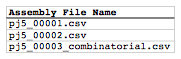

## Condensation of multiple j5 assembly files

The following is a step-by-step example of how to use j5 to condense multiple assembly files. This example uses the stand alone simplified web interface for j5.

Following the previous examples of how to use j5 (to design SLIC/Gibson/CPEC/SLiCE, combinatorial SLIC/Gibson/CPEC/SLiCE, Golden Gate, and combinatorial Golden Gate assemblies), we would like j5 to aggregate the assembly files resulting from these examples into a single condensed assembly file. This is a useful endeavor because it allows us to see all of the oligos, PCR reactions, and assembly pieces and combinations that will result in the entire collective set of constructs we would like to make, in one place. Since the assembly files to be condensed by j5 do not necessarily have to be related in any way, this not only facilitates the transition to 96-well format plates for use with high-throughput liquid-handling robotics platforms, but also allows us to easily aggregate multiple independent cloning projects (all designed with j5) side-by-side into the same 96-well plate(s).

Note that (combinatorial) Mock assembly files may not be condensed.

#### Step 1 - Create the assembly files to condense list file and the zipped assembly files file:

Once we have all of the assembly files we want to condense, we need to create two input files for j5, the assembly files to condense list file and the zipped assembly files file.  Using an existing sequences list file as a starting point (e.g. myassemblyfilelist.csv), we can use MS Excel, another spreadsheet program, or even a text editor, to create our assembly files to condense list CSV file (stylized for clarity, click to view larger version):

Here is the actual csv file: [myassemblyfilelist.csv](http://j5.jbei.org/j5manual/attachments/myassemblyfilelist01.csv)

Now, we make a zip file that contains all of the assembly files: [myassemblyfiles.zip](http://j5.jbei.org/j5manual/attachments/myasseblyfiles01.zip)

#### Step 2 - Use j5 to condense the assembly files:

Follow the directions on the stand alone simplified web interface documentation page for using j5 to condense assembly files. For the purposes of this example, the input files you will upload are:

  - Assembly files to condense list file: [myassemblyfilelist.csv](http://j5.jbei.org/j5manual/attachments/myassemblyfilelist00.csv)
  - Zipped assembly files file: [myassemblyfiles.zip](http://j5.jbei.org/j5manual/attachments/myasseblyfiles00.zip) 

Here is a representative zip file resulting from this particular condense assembly files example: [j5_J5_20100714170533.zip](http://j5.jbei.org/j5manual/attachments/j5_J5_201007141705330.zip)

#### Step 3 - Check the resulting condensed j5 assembly file:

Opening the condensed j5 assembly file with a spreadsheet program such as Excel or OpenOffice provides a quick glance at all of the oligos, PCR reactions, and assembly combinations that will be required to construct the entire set of plasmids derived from the set of assembly files that were condensed (see the condensed multiple j5 assembly files documentation for more information).

For this particular example (using the identical input files as listed above), the j5 condensed assembly output file is: [myassemblyfilelist_condensed.csv](http://j5.jbei.org/j5manual/attachments/myassemblyfilelist_co.csv)

That's it!