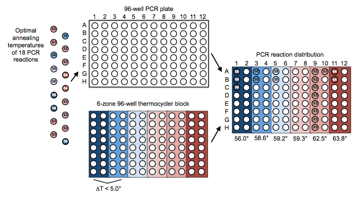
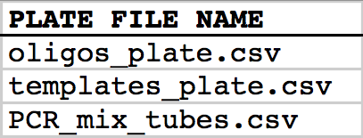

## Distribution of PCR reactions

The following is a step-by-step example of how to use j5 to distribute PCR reactions in multi-well plate across a thermocycler block annealing temperature gradient. This example uses the stand alone simplified web interface for j5.

Following the previous example of how to use j5 to aggregate assembly files into a single condensed assembly file, this example shows how to take a condensed j5 assembly file (or even a non-condensed assembly file coming directly out of a  SLIC/Gibson/CPEC/SLiCE, combinatorial SLIC/Gibson/CPEC/SLiCE, Golden Gate, or combinatorial Golden Gate assembly design process), and design a multi-well plate arrangement of the requisite PCR reactions, as well as the optimal thermocycler block (gradient) annealing temperature(s), with high-throughput liquid-handling robotics platforms in mind.

Here is an example set of PCR reactions (with indicated optimal annealing temperatures) that we might like j5 to distribute across a thermocycler block gradient for us:

#### Step 1 - Create the source plate list file and the zipped plate files file:

Once we have the j5 assembly file (e.g. myassemblyfilelist_condensed.csv, below) for which we'd like to distribute the PCR reactions across a multi-well plate, we need to create two input files for j5, the source plate list file and the zipped plate files file.  Using an existing source plate list file as a starting point (e.g. plate_list.csv), we can use MS Excel, another spreadsheet program, or even a text editor, to create our source plate list CSV file (stylized for clarity, click to view larger version):

Here is the actual csv file: [plate_list.csv](../../documents/plate_list0.csv)

In this particular example, we'll have one source plate file "oligos_plate.csv" that will describe a multi-well plate containing the oligos required for our assembly, and another source plate file "templates_plate.csv" that similarly describes a plate containing the PCR templates for our assembly. You can use these two files (you can find them contained within the zippled_plates.zip file below) as template starting points for your future use, modifying them to suit your needs with MS Excel, another spreadsheet program, or even a text editor. The organization of the oligos and PCR templates in the multi-well source plates is not important; you can arrange the oligos how ever you like (or how they came arrayed in 96-well format from a DNA oligo synthesis company such as IDT or Bioneer).
Now, we make a zip file that contains all of the source plate files: [zipped_plates.zip](../../documents/zipped_plates0.zip)

#### Step 2 - Make any modifications to the downstream automation assembly parameters that you require:

The default values for the downstream automation parameters will be appropriate for a 96-well format PCR setup, using a thermocycler block similar the one depicted above that has six annealing temperature zones (with adjacent zones that must be within 5 degrees C of each other). If your thermocycler is not 96-well format, you don't have the capacity to do annealing temperature gradients (or if your machine has a different configuration), or if you would like to make other modifications (such as changing the minimal liquid volume that you or your robot can accurately pipette), download the following template input file:
Downstream automation parameters file: [downstream_automation_parameters.csv](../../documents/downstream_automation0.csv)

and use MS Excel, another spreadsheet program, or even a text editor, to modify the downstream automation parameters, as you see fit. 

#### Step 3 - Use j5 to distribute the PCR reactions:

Follow the directions on the stand alone simplified web interface documentation page for using j5 to distribute PCR reactions. For the purposes of this example, the input files you will upload are:

  - Downstream automation parameters file: [downstream_automation_parameters.csv](../../documents/downstream_automation.csv) 
  - Source plate list file: [plate_list.csv](../../documents/plate_list.csv)
  - Zipped source plate files file: [zipped_plates.zip](../../documents/zipped_plates.zip)
  - j5 assembly file: [myassemblyfilelist_condensed.csv](../../documents/myassemblyfilelist_co2.csv)

Here is a representative zip file resulting from this particular distribute PCR reactions example: [j5_njhillson_20120706130016.zip](../../documents/j5_njhillson_20120706.zip)

#### Step 4 - Check the resulting distribute PCR reactions files:

Opening the distribute PCR reactions file with a spreadsheet program such as Excel or OpenOffice provides a glance at the designed arrangement of the PCR reactions in the multi-well plate, as well as the designed optimal annealing temperature(s) of the thermocycler block (see the distribute PCR reactions file documentation for more information).

Here is the distribute PCR reactions file for this particular example using the identical input files as listed above: [myassemblyfilelist_condensed_distribute_pcr.csv](../../documents/myassemblyfilelist_co1.csv)

Note that the arrangements of the 18 PCR reactions and the thermocycler zone annealing temperature gradient in this file matches that shown schematically in the figure above. 

In addition to the distribute PCR reactions file, j5 will also output a file that is specifically intended for use with the NextGen (eXeTeK) expression workstation robotics platform. This NextGen file has essentially the same content as the PCR Reactions subsection of the distribute PCR reactions file, except the plate wells are specified by index instead of by standard well nomenclature (e.g. 1-96 instead of A01-H12; the indexes increase sequentially down a given column and in leap across columns). The NextGen file has a few additional columns that are NextGen-specific, and lacks several columns that are not NextGen-relevant (see the NextGen (eXeTek) expression workstation control file documentation for more information).

Here is the NextGen file for this particular example using the identical input files as listed above: [myassemblyfilelist_condensed_distribute_pcr_NextGen.csv](../../documents/myassemblyfilelist_co0.csv)

In addition to the NextGen file, j5 will also output PR-PR configuration files. These files are related to the distribute PCR reactions file and the NextGen control file, but are distinct in that there is a separate PR-PR configuration file for each PCR plate to be prepared, and they currently include JBEI robot-specific configurations that can be modified as needed to suit other institutional configurations. See the PR-PR configuration file documentation for more information).
Here is the PR-PR configuration file for this particular example using the identical input files as listed above: [assemblytoautomate_distribute_pcr_PR_PR_1.pr](../../documents/assemblytoautomate_di.pr.txt)

#### Step 5 - Check the resulting updated plate list and zipped plate files files:

You will note that the resulting plate list file and the zipped plate files file have been updated.

The plate list file now additionally contains entries for any new PCR plates (stylized for clarity, click [here](../../images/pastedImage544.png) to view larger version)

In addition, the liquid volumes of the oligos and the PCR templates used in the PCR plates have been subtracted from the source plates (stylized for clarity, click to view larger version):

In this particular example, the PCR template "pj5_00001" started out in the source plate with 100 uL, but after 5 uL being dispensed in to each of 10 PCR reactions, only 50 uL remains available. If we had run out of "pj5_00001" template, j5 would have returned an error message. This is a useful precaution against not having enough available PCR template, oligos, etc., available in the source plate to set up all of the PCR reactions. If each well can hold a maximum volume, say 100 uL, it is possible to fill more than one source well with the same PCR template or oligo.

The new plate files in the resulting zipped plate files file are those corresponding to any new PCR plates.

That's it!