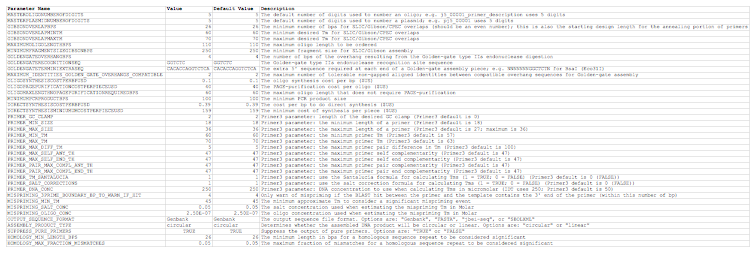

## j5 parameters file

The j5 parameters file is a CSV file that contains a list of all of the parameters that controls how j5 designs DNA assemblies. The order of parameter rows does not matter. If a given parameter row is missing from the parameters file, the default j5 parameter value is used. The first line in the file is a header line that does not contain parameter information, but rather just serves to name the columns below.

**Parameter Name** column fields:
entries must exactly match those shown in the example below.

**Value column** fields:
entries are (generally-speaking) user-specifiable. If there are discrete allowable choices (e.g. "Genbank" or "FASTA"), or a non-obvious maximum, etc., this is noted in the adjacent Description column field.

**Default Value** column fields:
The contents of these fields are purely for the benefit of the user, and does not affect the performance of j5 in any way. 

**Description column** fields:
The contents of these fields are purely for the benefit of the user, and does not affect the performance of j5 in any way. 

Here is what an **example j5 parameters file** looks like (stylized for clarity, click [here](../../images/pastedImage35A.png) to see enlarged version):

Here is the actual example j5 parameters CSV file (j5_parameters.csv):
