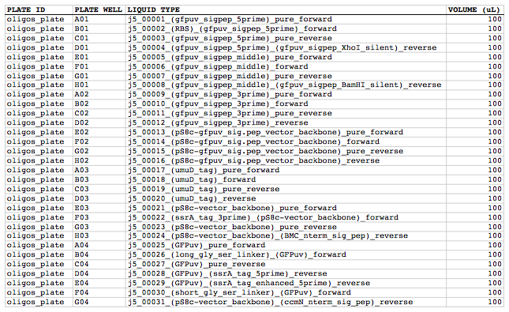

## Multi-well plate file

A multi-well plate file is a CSV file that contains a list of the liquid (sub-)contents for given wells in given plates. The first line in a multi-well plate file is a header line that does not contain plate well content information, but rather just serves to name the columns below. Each subsequent line/row in the file describes one additional liquid component in the given well of the given plate. For example, a particular well containing 85 uL of a PCR master mix, 5 uL of template, 5 uL of a forward primer, and 5 uL of a reverse primer (for 100 uL total well volume), would be described across four separate rows. 

**PLATE ID** column fields:
This is the name or ID of the multi-well plate (e.g. "OLIGO_PLATE"). These entries are completely user-specifiable (you can name each plate to your liking). Note that the contents within more than one multi-well plate can be described in the same multi-well plate file, using two (or more) distinct plate IDs in this column. The multi-well plate file name thus does not necessarily specify (and may be distinct from) the plate ID. 

**PLATE WELL** column fields:
The well in the multi-well plate (e.g. "A01"). The format of these entries should be one or two alphabetical characters (specifying the plate well row), followed by two integer characters (specifying the plate well column). For example, a standard format 96-well plate would span from "A01" to "H12", whereas a 1536-well plate (32 rows and 48 columns) would span from well "A01" to well "AF48".

**LIQUID TYPE** column fields:
This is the name or description of the liquid type or content (e.g. "pj5_00001"). These entries are completely user-specifiable. Note, as described above, that compound/mixed liquids should be entered as one row per each pure component. The data model for liquid types is rather limited currently (e.g. there is no separate data field for concentration, so 5 uL of 5 mM NaCl solution would be specified on a single row with "5 mM NaCl" as the liquid type column field and "5" in the volume column field; the software isn't smart enough to know that "5 mM NaCl" and "10 mM NaCl" are related contents).

**VOLUME** column fields:
This this the volume (in uL) of the row's specified liquid type in the well. Note that the downstream of j5 automation parameters file specifies the maximum liquid volume allowable in each well of the multi-well plate, so the volumes in rows specifying a given well in a given plate must sum to less than the maximum allowable volume for a well in the plate, or j5 will return an error message.

Here is what an **example plate file** looks like (stylized for clarity):

Here is the actual example multi-well plate CSV file (oligos_plate.csv): 
