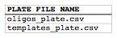

## Source plate list file and zipped source plate files file

The source plate list file is a CSV file that contains a list of all of the source plate files that will be drawn upon to supply the source materials (e.g. PCR templates and DNA oligos) for the downstream automation processes. The first line in the file is a header line that does not contain plate file information, but rather just serves to name the column below, namely PLATE FILE NAME.

**PLATE FILE NAME** column fields:
The multi-well plate file name, including ".csv" extension.

Here is what an **example source plate list file** looks like (stylized for clarity):

Here is the actual **example source plate list CSV file**: [plate_list.csv](../../documents/plate_list1.csv)

A zipped source plate files file is just a compressed (.zip) file that contains all of the plate files listed in the master source plates list file. The plate files may be zipped directly, or as part of a directory structure that contains all of the plate files. In the latter case, please ensure that no two plate files within the directory structure have identical names. If there is a repeated plate file name (at least for those plate files listed in the source plate list input file), j5 will issue a warning, and will use the first plate file with a matching name it finds.
Here is an example zipped source plate files file that corresponds to the example source plate list file above: [zipped_plates1.zip](../../documents/zipped_plates1.zip)