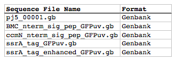

## Sequences list file and zipped sequences file

The sequences list file is a CSV file that contains a list of all of the source/template sequences from which DNA parts will be defined. The first line in the file is a header line that does not contain sequence file information, but rather just serves to name the columns below, namely Sequence File Name and Format.

**Sequence File Name** column fields:
The file names, including extention (e.g. ".gb", ".fas", or ".xml").

**Format** column fields:
Should either contain "Genbank", "FASTA", "jbei-seq", or "SBOLXML".

Here is what an **example sequences list file** looks like (stylized for clarity):

Here is the actual example sequences list CSV file (myseqlist.csv): 

The zipped sequences file is just a compressed (.zip) file that contains all of the sequence files (in Genbank, FASTA, jbei-seq , or SBOL XML format) listed in the sequences list file. The sequence files may be zipped directly, or as part of a directory structure that contains all of the sequence files. In the latter case, please ensure that no two sequence files within the directory structure have identical names. If there is a repeated sequence file name (at least for those sequence files listed in the sequence list input file), j5 will issue a warning, and will use the first sequence file with a matching name it finds.
Here is an **example zipped sequences file** that corresponds to the example sequences list file above (myseqs.zip):
