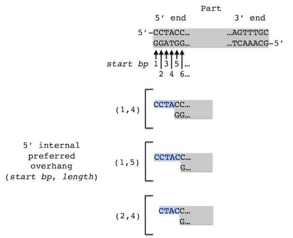
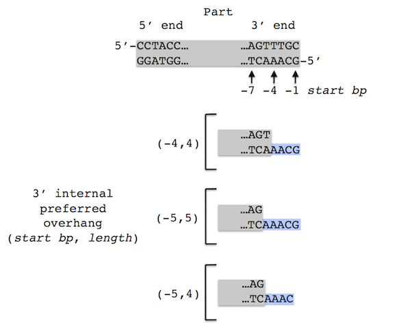
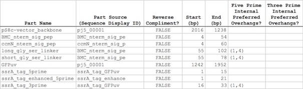

## Parts list file

The parts list file is a CSV file that contains the definitions of all of the DNA parts that may be utilized during the assembly process. The first line in the file is a header line that does not contain part definition information, but rather just serves to name the columns below.

**Part Name** column fields:
entries are completely user-specifiable.

**Part Source** column fields:
entries must exactly match Display IDs contained within the sequences listed in the sequences list file. Note that the Display ID is not the sequence file name, but rather the text that immediately follows the ">" character in FASTA files, the first field on the "LOCUS" line in Genbank files, or the "seq:name" field in jbei-seq files.

**Reverse Compliment?** column fields:
entries should either contain "FALSE" or "TRUE"; this column is only used for specifying the orientation of the part in the source template. The orientation(s) of the part in the assembled construct(s) are prescribed in the target part order list file.

**Start (bp)** and **End (bp)** column fields:
entries define the inclusive 5' and 3' boundaries (respectively) of the part in the source template; note that parts located within circular DNA may wrap around the "beginning" bp of the sequence and (exclusively in this instance) the Start bp will be larger than the End bp (i.e. the Reverse Compliment column should be used for specifying the orientation of the part; do not flip the Start/End bps in order to indicate reverse compliment, as this will not have the intended consequence). If the start or end columns are empty, by default they will be set to the first and last bp of the part source sequence, respectively.

**Five Prime Internal Preferred Overhangs?** column fields:
entries specify preferred overhangs/overlaps for the part at its 5' end. These overhangs/overlaps must be entirely contained within the part itself. Each preferred overhang/overlap is specified with a start bp and a length (in bp), in the format "(start bp, length)" (e.g., "(1,4)"). Multiple preferred overhangs/overlaps can be specified by separating the preferred overhang/overlaps with commas (e.g., "(1,4), (1,5), (2,4)").

The figure below shows a schematic of how pairs of start bp and a length correspond to the resulting 5' internal preferred overhangs/overlaps.

             
**Three Prime Internal Preferred Overhangs?** column fields:
entries specify preferred overhangs/overlaps for the part at its 3' end. These overhangs/overlaps must be entirely contained within the part itself. Each preferred overhang/overlap is specified with a start bp (relative to the end of the part) and a length (in bp), in the format "(start bp, length)" (e.g., "(-4,4)"). Multiple preferred overhangs/overlaps can be specified by separating the preferred overhang/overlaps with commas (e.g., "(-4,4), (-5,5), (-5,4)").

The figure below shows a schematic of how pairs of start bp and a length correspond to the resulting 3' internal preferred overhangs/overlaps.

Here is an **example parts list file** (stylized for clarity):

In this example, the pS8c_vector_backbone part starts at bp 2016 (inclusive, this part's 5' end), wraps all the way around the "end" of the vector, and continues through the "beginning", and extends to as far as bp 1238 (inclusive, this part's 3' end). Note that the Display IDs in the Part Source columns are not the same as the sequence file names from which the sequences are derived.
Here is the actual example parts list CSV file (partslist.csv):
