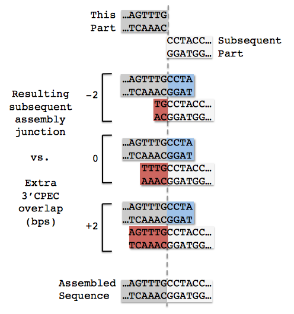
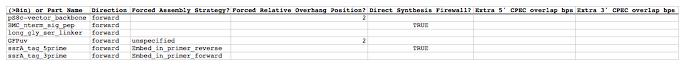
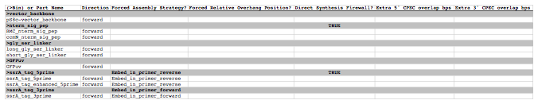

## Target part order list file

The target part order list file is a CSV file that determines how the DNA parts will be arranged in the assembly. The order of combinatorial bins or parts in the file matches the order of bins or parts in the resulting assembly (the last bin or part in the list will be cyclicly followed by the first bin or part). The same part may be utilized more than once in any given assembly. The first line in the file is a header line that does not contain target part ordering information, but rather just serves to name the columns below.

**(>Bin) or Part Name** column fields:
While bin names (preceded by a ">") are completely user-specifiable, part name field entries must exactly match a part name defined in the parts list file. Bin rows should only be present when performing combinatorial assemblies. For combinatorial assemblies, a bin row must precede any part row. Part rows belong to the immediately preceding bin row. 

**Direction** column fields (do not affect bin rows):
entries should either contain "forward" or "reverse". For parts, this will be the orientation of the part assembled into the target construct.

**Forced Assembly Strategy** column fields:
entries should either be empty or contain "unspecified" (to allow j5 the flexibility to choose) or, 

Conditional alternative forced assembly strategies:
1) For the first part or first bin and part(s) in the first bin (assumed to be the destination vector backbone(s)): "DIGEST" (to force restriction-enzyme digest, eliminating the possibility of adding flanking sequence).
2) For a contiguous set of bin(s) or part(s) whose total length is large enough to be PCR amplified (the size of which is defined in the j5 parameters file): "Direct Synthesis" (to force direct synthesis).
3) For bins or parts that are large enough to be PCR amplified (the size of which is defined in the j5 parameters file; "PCR" (to force PCR).
4) For bins or parts that are small enough to be embedded within a PCR oligo (the maximum size of which is defined in the j5 parameters file): "Embed_in_primer_reverse" (to force embedding the bin or part in the reverse primer of the preceding target bin or part) or "Embed_in_primer_forward" (to force embedding the bin or part in the forward primer of the subsequent target bin or part). Note that forced part embedding may be superseded in the instance that the neighboring part in whose primer the part was to be embedded is selected for "Direct Synthesis", in which case the small part to be embedded will also be directly synthesized.
5) For bins or parts that are small enough to be embedded within a DNA oligo: "Annealed Oligos".

If an assembly strategy is forced for a bin, it may affect the resulting identification of optimal Golden Gate overhangs (see the Brief survey of j5 functionality for more information). It is important to note that specifying an assembly strategy for a bin only affects the combinatorial template assembly design (and thereby the identified optimal Golden Gate overhangs); it remains necessary, if desired, to force an assembly strategy for each and every part in a bin (i.e. a part does not "inherit" a forced assembly strategy from the bin template). It is possible that some parts in a bin may be small enough to embed in a primer, and others are large enough to PCR amplify. This is a particular case in which assembly strategies will not be uniform throughout a bin. However, in order to minimize the number of oligos/direct synthesis pieces (and thus the cost) required for a combinatorial assembly, it is far better to have all of the parts in a bin uniform in assembly strategy.

Setting "Annealed Oligos" as the strategy for a bin/part also induces the creation of Direct Synthesis Firewalls (see below) immediately before and after the bin/part. See the Brief survey of j5 functionality for more information about the annealed oligos strategy.

**Forced Relative Overlap/Overhang Position** column fields (for combinatorial assemblies, do not affect part rows):
entries should either be empty or contain "unspecified" (to allow j5 the flexibility to choose), or a signed integral number (e.g. "2", "-2", "+13") of bps (to forcibly set a specific relative overlap/overhang position), or greater than or less than a signed integral number (e.g., ">2", "<-2", ">+13") of bps (to forcibly set the allowable range of relative overlap/overhang positions). The forced relative overlap/overhang position field only has an effect if the target bin or target part is 3' terminal part of an assembly piece.

NOTE: a forced relative overhang position, specified in the same row as (associated with) a given part or combinatorial bin, affects the overhang at the 3' end of the assembly piece that contains the given part or combinatorial bin.

A neutral relative overlap/overhang position (i.e. 0 bp) derives half of the overlap/overhang (e.g. 13 bp of a 26 bp SLIC/Gibson/CPEC/SLiCE overlap or shown here 2 bp of a 4 bp BsaI Golden Gate overhang) from the 3' end of this part and the other half of the overhang from the 5' end of the subsequent part. A relative overlap/overhang position of 2 bp incorporates two less bps from this part, and two additional bps from the subsequent part and so on (NOTE shown here are the 5' overhangs for Golden Gate assembly, but the concept is the same for SLIC/Gibson/CPEC/SLiCE overlaps):

Relative overlaps/overhangs more negative than minus half the minimum SLIC/Gibson/CPEC/SLiCE overlap length (e.g. -13) or minus half the Golden Gate overhang length (e.g. -2) result in the removal of base pairs from the 3' end of the preceding part (these same bps are transferred to the 5' of the subsequent part). The reciprocal is true for relative overhangs greater than half the minimum SLIC/Gibson/CPEC/SLiCE overlap length (e.g. 13) or half the Golden Gate overhang length (e.g. 2). Relative overhangs between these two limits result in adding 0 or more bps to the respective termini, to complete the overlap/overhang.

To force the overhang/overlap to be entirely contained within the part 5' to the assembly junction ("this part" in the figure above), set the forced relative overlap/overhang to less than one minus half of the Golden Gate overhang length (e.g. "<-1") or one minus half the minimum SLIC/Gibson/CPEC/SLiCE overlap length (e.g. "<-12"). Alternatively, to force the overhang/overlap to be entirely contained within the part 3' to the assembly junction ("subsequent part" in the figure above), set the forced relative overlap/overhang to greater than half of the Golden Gate overhang length minus one  (e.g. ">1") or half the minimum SLIC/Gibson/CPEC/SLiCE overlap length minus one (e.g. ">12").

Refer to the Brief survey of j5 functionality documentation for an explanation of why forcibly setting a relative overhang position might be useful.

**Direct Synthesis Firewall** column fields (for combinatorial assemblies, only affects bin rows):
entries should either be empty or contain "FALSE" (to allow j5 flexibility), or contain "TRUE". A direct synthesis firewall "TRUE" field prevents a direct synthesis piece from extending from a marked target part row to the target part in the next row. A direct synthesis firewall is useful in the context of combinatorial assemblies, in which it is often less expensive to keep the two parts separated by a universal junction, so that each part may be assembled independently of the other, despite the fact that it could be cheaper to directly synthesize a single fused piece when assembling a single plasmid construct.

**Extra 5' CPEC overlap bps** column fields (only applies to SLIC/Gibson/CPEC/SLiCE style assemblies; for combinatorial SLIC/Gibson/CPEC/SLiCE assemblies, only affects bin rows):
entries should either be empty or contain "unspecified" (to allow j5 the flexibility to choose), or a positive or negative integral number of extra bps to add to the 3' end of the minimal overlap at the selected relative overlap position of the assembly junction immediately preceding (5' of) the bin template or target part. The extra 5' CPEC overlap bps field only has an effect if the bin template or target part is either a PCR amplified part (not embedded within an oligo), or the 3' terminal part to be incorporated into a direct synthesis piece.

To simplify the example below, the minimal overlap is taken to be 8 bp, and the relative overlap position for this assembly junction is taken to be neutral. Adding no extra 5' or 3' CPEC overlap bps would result in an 8 bp overlap with the first 4 bps (blue) originating from the preceding part (white) and the second 4bps (red) originating from the current part (grey). If we add 2 extra 5' CPEC overlap bps, the red portion of the overlap increases by 2 bp. If we subtract 2 bp from 5' CPEC overlap, the red portion of the overlap decreases by 2 bp (NOTE: the blue region must be concomitantly increased by 2 or more bp to compensate so as to achieve the minimal overlap of 8 bp; not shown). 

NOTE: extra 5' CPEC overlap bps, specified in the same row as (associated with) a given part or combinatorial bin, affects the overlap at the 5' end of the assembly piece that contains the given part or combinatorial bin.

**Extra 3' CPEC overlap bps** column fields (only applies to SLIC/Gibson/CPEC/SLiCE style assemblies; for combinatorial SLIC/Gibson/CPEC/SLiCE assemblies, only affects bin rows):
entries should either be empty or contain "unspecified" (to allow j5 the flexibility to choose), or a positive or negative integral number of extra bps to add to the 5' end of the minimal overlap at the selected relative overlap position of the assembly junction immediately following (3' of) the bin template or target part. The extra 3' CPEC overlap bps field only has an effect if the bin template or target part is either a PCR amplified part (not embedded within an oligo), or the 3' terminal part to be incorporated into a direct synthesis piece.

To simplify the example below, the minimal overlap is taken to be 8 bp, and the relative overlap position for this assembly junction is taken to be neutral. Adding no extra 5' or 3' CPEC overlap bps would result in an 8 bp overlap with the first 4 bps (red) originating from the current part (grey) and the second 4bps (blue) originating from the subsequent part (white). If we add 2 extra 3' CPEC overlap bps, the red portion of the overlap increases by 2 bp. If we subtract 2 bp from 3' CPEC overlap, the red portion of the overlap decreases by 2 bp (NOTE: the blue region must be concomitantly increased by 2 or more bp to compensate so as to achieve the minimal overlap of 8 bp; not shown). 

NOTE: extra 3' CPEC overlap bps, specified in the same row as (associated with) a given part or combinatorial bin, affects the overlap at the 3' end of the assembly piece that contains the given part or combinatorial bin.

Here is an **example target parts ordering file** (stylized for clarity):

Note in this example that direct synthesis firewalls prevent contiguous direct synthesis from the BMC_nterm_sig_pep to the long_gly_ser_linker part, and also from the ssrA_tag_5prime to the ssrA_tag_3prime part. The Forced Relative Overhang positions will only apply if the pS8c-vector_backbone and GFPuv parts are either PCR'd, or are the 3' terminal parts of direct synthesis contigs.
Here is the actual example parts list CSV file (targetpartorderlist.csv): 

Here is an **example combinatorial target parts ordering file** (stylized for clarity):

Note in this example that although we specify the assembly strategies for the ">ssrA_tag_5prime" and ">ssrA_tag_3prime" bins, we still must specify the forced assembly strategies of the parts contained within those bins, if desired.
Here is the actual example parts list CSV file (targetpartorderlist_combinatorial.csv):
