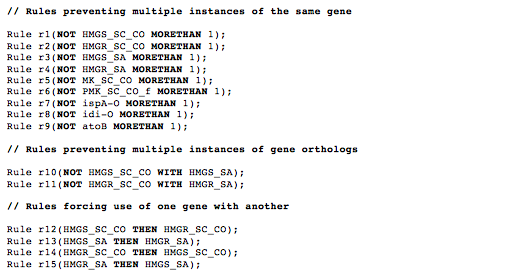

## Eugene rules list file

The Eugene ([Bilitchenko 2011A](http://www.ncbi.nlm.nih.gov/pubmed/21559524), [Bilitchenko 2011B](http://www.ncbi.nlm.nih.gov/pubmed/21601677)) (a biological design specification computer language) rules list file is a text file that contains a list of design rules. j5 checks that these rules are satisfied prior to designing an assembly. Currently, j5 only enforces six types of Eugene rules (see below) and ignores all other rules and declarations; all lines that do not begin with "Rule" are ignored, as well as is everything following the commenting escape characters "//". Currently, composite rules (e.g. utilizing AND, OR, XOR operators) are not supported, but will be in the future.

SLIC/Gibson/CPEC/SLiCE and Golden-gate assemblies designed with j5:
If any of the specified design rules are broken, j5 terminates the assembly design and returns an error message.

Combinatorial Golden-gate and Combinatorial SLIC/Gibson/CPEC/SLiCE assemblies designed with j5:
j5 skips combinations of parts that break any of the specified design rules.

#####Rule syntax: 
Rule <i>rule_name</i>([NOT] <i>operand1 compositional_operator operand2</i>);

The [NOT] is an optional rule negation operator.

The <i>rule_name</i> currently has no significant effect on the j5 design process, other than providing a name for the first rule in the list that was broken that resulted in j5 not pursuing the assembly.

<i>operand1</i> is a part name specified in the parts list file.

<i>compositional_operator</i> is one of the following six operators: "AFTER", "BEFORE", "WITH", "THEN", "NEXTTO", or "MORETHAN".

<i>operand2</i> is either an integral copy number (if the <i>compositional_operator</i> is "MORETHAN") or a part name specified in the parts list file (if the <i>compositional_operator</i> is "AFTER", "BEFORE", "WITH", "THEN", or "NEXTTO").

**AFTER** operator:
Rule <i>rule_name</i>([NOT] <i>operand1</i> AFTER <i>operand2</i>);
Rules utilizing the AFTER operator (or its [NOT] negated version) only apply to those devices that contain both part <i>operand1</i> and part <i>operand2</i>. In the same linear construct, all instances of part <i>operand1</i> must occur after (to the 3' of) all instances of part <i>operand2</i>. Note that this is equivalent to Rule <i>rule_name</i>(<i>operand2</i> BEFORE <i>operand1</i>). This rule is ignored for circular constructs. Note that the AFTER operator does not take into consideration the directionalities (forward/reverse) of <i>operand1</i> and <i>operand2</i>.

**BEFORE** operator:
Rule <i>rule_name</i>([NOT] <i>operand1</i> BEFORE <i>operand2</i>);
Rules utilizing the BEFORE operator (or its [NOT] negated version) only apply to those devices that contain both part <i>operand1</i> and part <i>operand2</i>. In the same linear construct, all instances of part <i>operand1</i> must occur before (to the 5' of) all instances of part <i>operand2</i>. Note that this is equivalent to Rule <i>rule_name</i>(<i>operand2</i> AFTER <i>operand1</i>). This rule is currently ignored for circular constructs. Note that the BEFORE operator does not take into consideration the directionalities (forward/reverse) of <i>operand1</i> and <i>operand2</i>.

**WITH** operator:
Rule <i>rule_name</i>([NOT] <i>operand1</i> WITH <i>operand2</i>);
Part <i>operand1</i> and part <i>operand2</i> must both occur in every construct. Note that this definition of the WITH operator is different from (and much more strict than) its original implementation in j5, which has been migrated to the THEN operator. For backwards compatibility, the NOTWITH operator is currently supported and equivalent to (NOT <i>operand1</i> WITH <i>operand2</i>), although support for NOTWITH may be deprecated going forward.

**THEN** operator:
Rule <i>rule_name</i>([NOT] <i>operand1</i> THEN <i>operand2</i>);
Rules utilizing the THEN operator (or its [NOT] negated version) only apply to those devices that contain part <i>operand1</i>. Part <i>operand1</i> only occurs if part <i>operand2</i> also occurs in the same construct.  This is a useful rule to set if you are designing a combinatorial library where some of the parts require the presence of specific partner parts. Note that this rule is not symmetric, so <i>operand1</i> THEN <i>operand2</i> does not imply <i>operand2</i> THEN <i>operand1</i>. Note that the THEN operator is equivalent to the original implementation of the WITH operator in j5.

**NEXTTO** operator:
Rule <i>rule_name</i>([NOT] <i>operand1</i> NEXTTO <i>operand2</i>);
Rules utilizing the NEXTTO operator (or its [NOT] negated version) only apply to those devices that contain part <i>operand1</i>. In the same construct, all instances of part <i>operand1</i> must occur immediately before or immediately after an instance of part operand2. Note that this rule is not symmetric, so <i>operand1</i> NEXTTO <i>operand2</i> does not imply <i>operand2</i> NEXTO operand1.

**MORETHAN** operator:
Rule <i>rule_name</i>([NOT] <i>operand1</i> MORETHAN <i>operand2</i>);
Part <i>operand1</i> must occur more than <i>operand2</i> times in each construct. This is a useful rule to set if you are designing a combinatorial library where you would like to have the order of parts shuffled (which requires placing the same part in multiple target part bins (see the target part list file documentation for more information), and you would like the copy number of each part above a certain threshold (i.e. you are not interested in assembling a plasmid without a gene present at least once). For backwards compatibility, the NOTMORETHAN operator is currently supported and equivalent to (NOT <i>operand1</i> MORETHAN <i>operand2</i>), although support for NOTMORETHAN may be deprecated going forward.

Here is an **example Eugene rules list file** (stylized for clarity):

In this example, note that the seemingly redundant rules that contain the THEN operator need to be defined twice to ensure a symmetric dependency.

Here is the actual example Eugene rules list file (eugenerules.eug):

