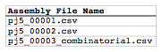

## Assembly files to condense list file and zipped assembly files file

The assembly files to condense list file is a CSV file that contains a list of all of the assembly files that will be aggregated together. The first line in the file is a header line that does not contain sequence file information, but rather just serves to name the column below, namely Assembly File Name.

**Assembly File Name** column fields:
The assembly file name, including ".csv" extention.

Here is what an **example assembly files to condense list file** looks like (stylized for clarity):

Here is the actual example sequences list CSV file (myassemblyfilelist.csv): 

The zipped sequences file is just a compressed (.zip) file that contains all of the assembly files listed in the assembly files to condense list file. The assembly files may be zipped directly, or as part of a directory structure that contains all of the assembly files. In the latter case, please ensure that no two assembly files within the directory structure have identical names. If there is a repeated assembly file name (at least for those assembly files listed in the assembly files to condense list input file), j5 will issue a warning, and will use the first assembly file with a matching name it finds.
Here is an **example zipped assembly files file** that corresponds to the example assembly files to condense list file above (myassemblyfiles.zip): 
