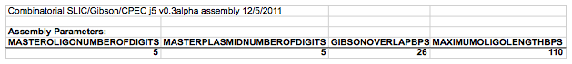

## Combinatorial SLIC/Gibson/CPEC/SLiCE assembly output file

The combinatorial SLIC/Gibson/CPEC/SLiCE assembly j5 output file is a CSV file that contains all of the information resulting from the combinatorial SLIC/Gibson/CPEC/SLiCE assembly design process. The first line in the file is a header line that just serves to identify the assembly method selected (e.g. "Combinatorial SLIC/Gibson/CPEC"), as well as the version of j5 used to generate the assembly (e.g. "v0.3alpha") and the date that the assembly was designed (e.g. "12/5/2011").

#### Assembly Parameters subsection:
displays the j5 parameters selected for the assembly design process, which were dictated by the j5 parameters file.

Here is an example first line header and Assembly Parameters subsection (truncated after the fourth column, stylized for clarity):

#### Target Bin Selected Relative Overlap Positions and Extra 5'/3' CPEC bps subsection:
displays the j5 selected relative overlap positions and the extra 5' and 3' CPEC bps for the combinatorial target bins.

Depending on the particular assembly, a number of warning messages may immediately precede the Target Bin Selected Relative Overlap Positions and Extra 5'/3' CPEC bps subsection. These include warnings that one or more assembly junctions are over-constrained, precluding full combinatorial assembly piece re-use and increasing costs. When an assembly junction is over constrained, j5 relaxes the constraint of a constant overlap for the assembly junction. 

Here is an example of the warning messages that may immediately precede the Target Bin Selected Relative Overlap Positions and Extra 5'/3' CPEC bps subsection (click [here](../../images/pastedImage33A.png) to see enlarged version):

ID Number column fields:
each combinatorial target bin is enumerated, starting with "0".

Name column fields:
the name of the combinatorial bin, as provided in the target part order list file.

Relative Overlap Position (bp) column fields:
The selected relative overlap position between this combinatorial bin, and the next. See the target part order list file documentation for more information. Note that these relative overlaps are derived from the results of designing a template SLIC/Gibson/CPEC/SLiCE assembly (see the Brief survey of j5 functionality for more information), and as such, the relative overlap positions for some combinatorial bins will remain "unspecified". This is often the case if a combinatorial bin contains parts that will be embedded within and oligo, or if the combinatorial bin will be embedded within (but not at the right terminus) of a direct synthesis piece. For linear DNA products, this field will be blank for the last target bin.

Extra 5' CPEC bps column fields:
The number of extra bps at the 3' end of the overlap for the assembly junction preceding (5' of) this combinatorial bin. For linear DNA products, this field will be blank for the last target bin.

Extra 3' CPEC bps column fields:
The number of extra bps at the 5' end of the overlap for the assembly junction following (3' of) this combinatorial bin. For linear DNA products, this field will be blank for the last target bin.

Here is an example Target Bin Selected Relative Overhang Positions subsection (stylized for clarity):

Combinations of Assembly Pieces subsection:
displays which assembly pieces to combine together to generate each of the desired combinatorial variants.

Variant Number column fields:
each assembly combination is enumerated, starting with "0".

Name column fields:
the name of the resulting plasmid for this combination, generated as described in the master plasmids list file documentation section.

Assembly Method column fields:
the assembly method selected to generate this combinatorial variant. For combinatorial SLIC/Gibson/CPEC/SLiCE assembly, this will always be "SLIC/Gibson/CPEC". However, when condensing multiple arbitrary j5 assembly files, see the j5 Condense multiple j5 assembly files output file documentation, this might also include "Golden Gate".

Bin N -
Part(s) column fields:
The part(s) embedded within assembly piece N for this combinatorial variant, using the same notation described in the Oligo Synthesis subsection, see the j5 SLIC/Gibson/CPEC/SLiCE assembly design output file documentation.

Assembly Piece ID Number column fields:
The ID Number, referencing the Assembly Pieces (Golden Gate) subsection (or the Assembly Pieces (SLIC/Gibson/CPEC/SLiCE) subsection when condensing multiple arbitrary j5 assembly files), of the assembly piece N for this combinatorial variant.

Here is an example Combinations of Assembly Pieces subsection (stylized for clarity):

Other subsections:
are identical to those described for the j5 SLIC/Gibson/CPEC/SLiCE assembly design output file.

NOTE: several warning messages (including those related to primer design difficulties) are not output in the Combinatorial SLIC/Gibson/CPEC/SLiCE output file. They are only listed in the SLIC/Gibson/CPEC/SLiCE assembly design output files for each individual assembly. As such, it is important to check the individual assembly design output files for these warnings before pursuing the combinatorial collection of assemblies.

Example j5 output combinatorial SLIC/Gibson/CPEC/SLiCE assembly file:
Here is an example j5 combinatorial SLIC/Gibson/CPEC/SLiCE assembly output CSV file: [pGG_00005_combinatorial.csv](../../documents/pGG_00005_combinatori1.csv)
