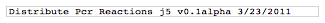
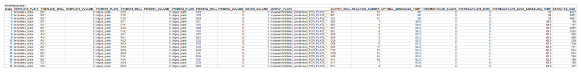
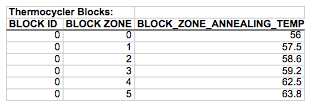

## Distribute PCR reactions file

The distribute PCR reactions j5 output file is a CSV file that contains information resulting from designing thermocycler block annealing temperature gradients for the set of PCR reactions contained within a j5 assembly file, and optimally arranging the PCR reactions on the block with respect to the designed gradient. The first line in the file is a header line that just serves to identify the downstream automation task selected (e.g. "Distribute PCR Reactions"), as well as the version of j5 used to generate the assembly (e.g. "v0.1alpha") and the date that the assembly was designed (e.g. "3/23/2011").

Here is an example first line header:

If any problems are encountered when inputting the downstream automation parameters file, or if more than six source plates are utilized (no PR-PR configuration files output), j5 will place the resulting warning messages immediately following the first line header.

<b>PCR Reactions</b> subsection:
displays how the PCR reactions will be arranged on the resulting multi-well plates.

<b>Index column</b> fields:
A sequential order of the PCR reactions, starting with "1", arranged from lowest to highest optimal annealing temperature.

<b>TEMPLATE_PLATE</b> column fields:
The name of the multi-well plate serving as the source of the PCR template for this row's PCR reaction.

<b>TEMPLATE_WELL</b> column fields:
The name of the well (e.g. "A01") containing the PCR template for this row's PCR reaction.

<b>TEMPLATE_VOLUME</b> column fields:
The volume (in uL) of the PCR template to be used for this row's PCR reaction.

<b>PRIMER1_PLATE</b> column fields:
The name of the multi-well plate serving as the source of the forward primer for this row's PCR reaction.

<b>PRIMER1_WELL</b> column fields:
The name of the well (e.g. "A01") containing the forward primer for this row's PCR reaction.

<b>PRIMER1_VOLUME</b> column fields:
The volume (in uL) of the forward primer to be used for this row's PCR reaction.

<b>PRIMER2_PLATE</b> column fields:
The name of the multi-well plate serving as the source of the reverse primer for this row's PCR reaction.

<b>PRIMER2_WELL</b> column fields:
The name of the well (e.g. "A01") containing the reverse primer for this row's PCR reaction.

<b>PRIMER2_VOLUME</b> column fields:
The volume (in uL) of the reverse primer to be used for this row's PCR reaction.

<b>WATER_VOLUME</b> column fields:
The volume (in uL) of water to be added to this row's PCR reaction.

<b>OUTPUT_PLATE</b> column fields:
The name of the multi-well PCR plate serving as the destination for this row's PCR reaction.

<b>OUTPUT_WELL</b> column fields:
The name of the well (e.g. "A01") serving as the destination for this row's PCR reaction.

<b>REACTION_NUMBER</b> column fields:
The number corresponding to the PCR Reaction ID Number in the input j5 assembly file for this PCR row's reaction.

<b>OPTIMAL_ANNEALING_TEMP</b> column fields:
The optimal annealing temperature (in degrees C) for this row's PCR reaction. This is calculated as 2 degrees C above the minimum 3'-only Tm of the forward and reverse primers for this row's PCR reaction, as specified in the input j5 assembly file.

<b>THERMOCYCLER_BLOCK</b> column fields:
The thermocycler block assigned to this row's PCR reaction. Note that the zone numbering starts with "0".

<b>THERMOCYCLER_ZONE</b> column fields:
The thermocycler zone assigned to this row's PCR reaction. Note that the zone numbering starts with "0".

<b>THERMOCYCLER_ZONE_ANNEALING_TEMP</b> column fields:
The designed annealing temperature (in degrees C) for the thermocycler zone selected for this row's PCR reaction. 

<b>EXPECTED_SIZE</b> column fields:
The anticipated size (in b[) for the product of this row's PCR reaction. 

<b>SEQUENCE</b> column fields:
The sequence of each part is extracted from the master sequences based on their definitions in the parts list file.

Here is an example PCR Reactions subsection (stylized for clarity, click [here](../../images/pastedImage93A.png) to see an enlarged version):

<b>Thermocycler Blocks</b> subsection:
displays the designed annealing temperature zone gradients for each of the thermocycler blocks.

<b>BLOCK_ID</b> column fields:
The thermocycler block assigned to this row's PCR reaction. Note that the zone numbering starts with "0".

<b>BLOCK_ZONE</b> column fields:
The thermocycler zone assigned to this row's PCR reaction. Note that the zone numbering starts with "0".

<b>BLOCK_ZONE_ANNEALING_TEMP</b> column fields:
The designed annealing temperature (in degrees C) for the thermocycler zone selected for this row's PCR reaction. 

Here is an example Thermocycler Blocks subsection (stylized for clarity):

Here is the actual distribute PCR reactions CSV file (myassemblyfilelist_condensed_distribute_pcr.csv):

