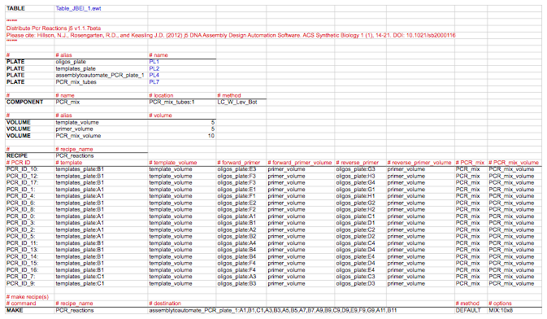

## PR-PR distribute PCR reactions configuration (.pr) files

PR-PR Distribute PCR reactions configuration (.pr) j5 output files are tab-delimited text files written in the PR-PR (Programming a Robot) open-source biology-friendly robot programming language (under development by Gregory Linshiz and Nina Stawski) that instruct a liquid-handling robotic platform (e.g. a Tecan Freedom Evo) how to put together the desired PCR reaction mixtures from the specified source plates containing the DNA templates and oligos and into the destination PCR plates. These files are related to the distribute PCR reactions file and the NextGen expression workstation control file, but are distinct in that there is a separate PR-PR configuration file for each PCR plate to be prepared (because there are a limited number of plate locations on the robotic table, and without a robotic gripper-arm that can rearrange plates, preparing multiple PCR plates in the same PR-PR run might not be feasible), and they currently include JBEI robot-specific configurations (described below) that can be modified as needed to suit other institutional configurations.

TABLE line:
Provides the name of the robotic table layout definition file to use.

In the example shown below, "Table_JBEI_1.ewt" is the name of the file that defines the table layout of JBEI's Tecan Freedom Evo robot. Change the name of the file to suit your institutional configuration.

Here is the JBEI Tecan Freedom Evo robot-specific worktable configuration with the destination PCR plate in location "PL4" and the PCR master mix in plate location "PL7":

""""…"""" section:
The documentation section of the configuration file, spanning everything between the pair of (three or more) quotation marks. In this section, j5 inserts:

Distribute PCR Reactions j5 version
Please cite: Hillson, N.J., Rosengarten, R.D., and Keasling J.D. (2012) j5 DNA Assembly Design Automation Software. ACS Synthetic Biology 1 (1), 14-21. DOI: 10.1021/sb2000116

where version is the current version of j5 (e.g. v1.1.5beta).

PLATE lines:
Specify a name alias for each oligo, template, and PCR plate; and the PCR master mix tube rack.

j5 currently uses plates "PL1", "PL2", "PL3", "PL5", "PL6", and "PL8" for the source plates (e.g. those containing the DNA oligo primers and templates). Plates "PL4" and "PL7" are reserved for the PCR plate and PCR master mix tube rack locations, respectively; these could be changed to suit your institutional configuration. If a PCR reaction distribution process requires more than 6 source plates (and thereby source plate locations), j5 will abort the PR-PR configuration file generation process and instead issue a warning accordingly in the distribute PCR reactions file. 

In the example shown below, there are two source plates ("oligos_plate" and "templates_plate"), one PCR plate ("assemblytoautomate_PCR_plate_1"), and one PCR master mix tube rack ("PCR_mix_tubes"). "oligos_plate" and "templates_plate" are aliases for plates "PL1" and "PL2" (which happen to be skirted 96-well micro-titer plate locations for the JBEI Tecan Freedom Evo robot-specific configuration), respectively, "assemblytoautomate_PCR_plate_1" is the alias for plate "PL4" (which happens to be a half-skirted 96-well PCR plate location for the JBEI Tecan Freedom Evo robot-specific configuration), and "PCR_mix_tubes" is the alias for plate  "PL7" (which happens to be an Eppendorf tube rack location for the JBEI Tecan Freedom Evo robot-specific configuration).

COMPONENT lines:
Specify a name, a location, a liquid class, and dispense/aspirate styles, for the PCR master mix.

In the example shown below:
For the PCR master mix, the name is "PCR_mix", the location is the tube rack and tube (tube rack:tube) where the PCR master mix is located ("PCR_mix_tubes:1"), the liquid class is water, liquid is to be dispensed into the tube at liquid surface level, and liquid is to be aspirated from the bottom of the tube ("LC_W_Lev_Bot").

VOLUME lines:
Specify volume (in uL) aliases for the template (minimum pipetting volume as defined in the downstream automation parameters file), primer (minimum pipetting volume), and PCR mix (twice the minimum pipetting volume).

RECIPE line and subsection:
Specifies the overall name of the PCR reactions recipe ("PCR_reactions"), and the contents of each PCR reaction to be put together.

The contents of each PCR reaction is specified, one per line:

The first column is the name of the PCR reaction followed by a colon ':' character (e.g. "PCR_ID_10:"), the second is the location of the template (e.g. "templates_plate:B1"), the third is the template volume (e.g. "template_volume"), the fourth is the location of the forward primer (e.g. "oligos_plate:E3"), the fifth is the forward primer volume (e.g. "primer_volume"), the sixth is the location of the reverse primer (e.g. "oligos_plate:G3"), the seventh is the reverse primer volume (e.g. "primer_volume"), the eighth is the name of the PCR master mix (e.g. "PCR_mix"), and the ninth is the volume of the PCR master mix reagent (e.g. "PCR_mix_volume").

MAKE line:
Specifies to make the PCR reactions recipe, which PCR destination plate to use, the wells in the PCR plate that correspond with each of the PCR reactions in the recipe, and how to mix the prepared reactions.

In the example shown below, the "PCR_reactions" recipe is to be made, the plate "assemblytoautomate_PCR_plate_1" (defined above in the PLATE subsection) is the destination plate, wells "A1,B1,C1,A3,B3,A5,B5,A7,B7,A9,B9,C9,D9,E9,F9,G9,A11,B11" correspond with the ordered PCR reactions in the "PCR_reactions" recipe, the aspiration/dispensing style is the default (the liquid is to be dispensed at the bottom of the well, and liquid is to be aspirated from the bottom of the well ("LC_W_Bot_Bot")), and mixing is accomplished by pipetting 10uL up-and-down 8 times ("MIX:10x8").

Here is an example PR-PR Distribute PCR reactions configuration file (stylized for clarity; click to see an enlarged version):

PR-PR keywords are highlighted in bold (e.g. "TABLE", "PLATE", "COMPONENT", "VOLUME", "RECIPE", and "MAKE"). JBEI robot-specific configurations that can be modified as needed (described above) are colored in blue (e.g. "Table_JBEI_1.ewt", "PL1"). The documentation section (""""…"""") and all comment (i.e. ignored) lines (#…) are colored in red. 

Here is the actual PR-PR Distribute PCR reactions configuration file (assemblytoautomate_distribute_pcr_PR_PR_1.pr):
