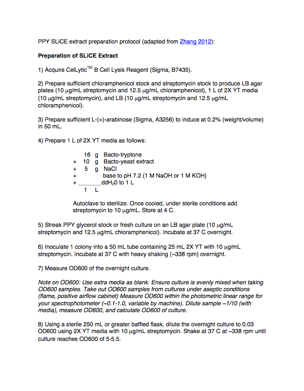
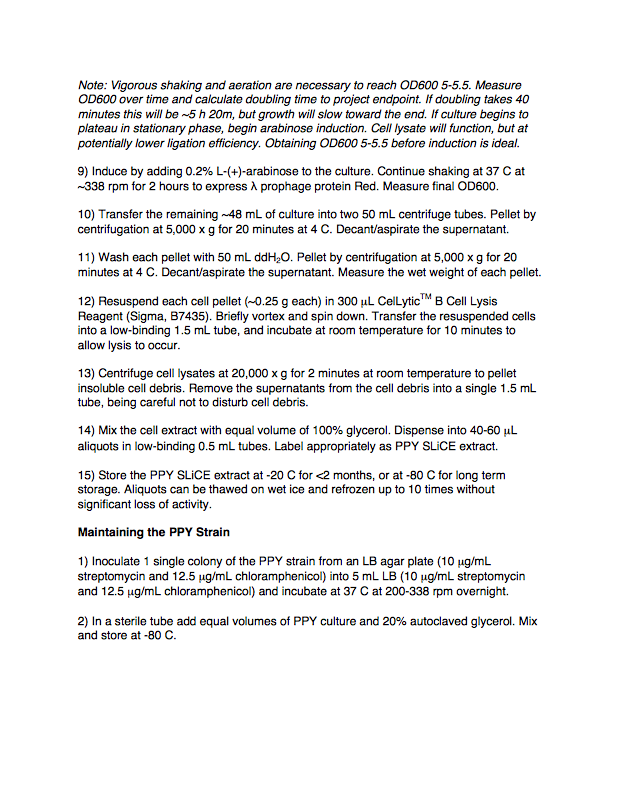
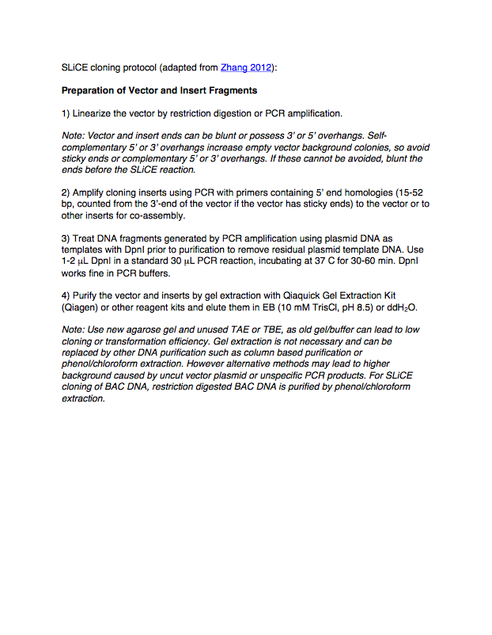
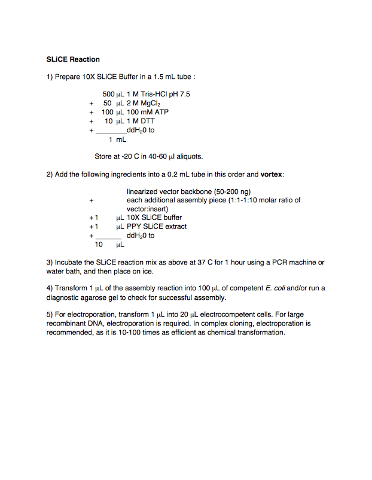

## SLiCE

Here is the SLiCE DNA assembly protocol (adapted from Zhang 2012):

Here is the actual word document of the above protocol (PPY SLiCE extract protocol.docx):

Here is the actual word document of the above protocol (SLiCE Cloning.docx): 
