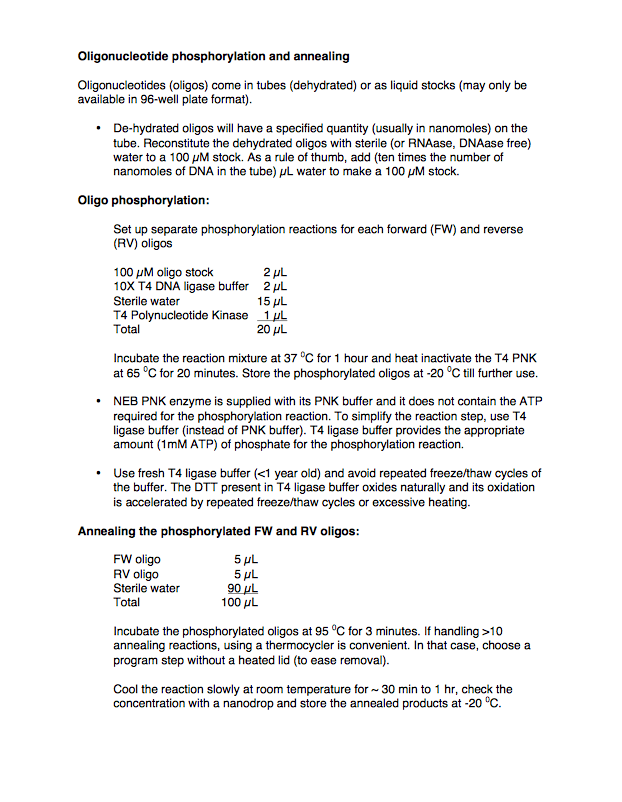

## 5' phosphorylation of annealed DNA oligos

Here is the protocol for the 5' phosphorylation of annealed DNA oligos:

Here is the actual word document of the above protocol (Oligonucleotide phosphorylation and annealing.docx):
