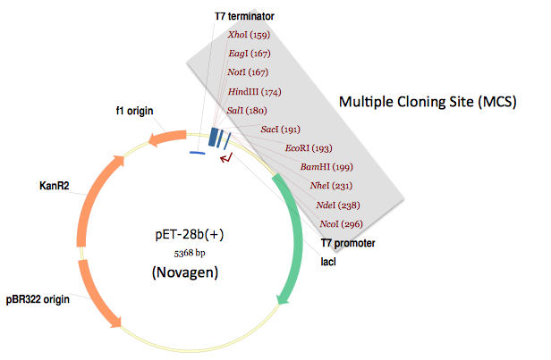

##The traditional multiple cloning site approach

TeselaGen does not design DNA assembly using the traditional multiple cloning site, restriction enzyme, ligase cloning approach. However, to better understand why TeselaGen does not, and to contrast its methodologies with that which the current majority of molecular biologists routinely use, it is worthwhile to briefly review the traditional approach.

Shown below is a typical expression destination vector designed with the traditional approach in mind. 

In this specific example, a multiple cloning site (MCS) follows a T7 promoter, and is in turn followed by a T7 terminator. If a researcher wants to integrate a protein coding sequence of interest into this expression vector, he or she: 1) identifies two restriction sites present in the MCS, but absent in the coding sequence of interest, 2) PCR amplifies the coding sequence of interest with DNA oligo primers flanked with the selected restriction sites, 3) digests the PCR product as well as the destination vector with the corresponding restriction enzymes, 4) gel-purifies the digested PCR product and the destination vector backbone, 5) ligates the purified digested PCR product and destination vector, and 6) transforms the resulting ligation reaction into competent _E. coli_.

This approach works well for integrating a single coding sequence into the MCS of the destination expression vector. The large number of multiple cloning sites (11 in the example shown above) results in a high likelihood that at least two of the sites will be absent from the coding sequence of interest. However, as soon as we would like to incorporate multiple DNA sequence fragments into the same destination vector, such as an entire metabolic pathway or genetic circuit, as shown in the previous DNA assembly example, the odds are less on our side. Now, we must find as many distinct restriction sites (or resulting overhang sequences, to be more precise; with sequential sites absent from the DNA fragment they flank) as the number of DNA fragments to be assembled (including the destination vector), and two of these (flanking the linearized destination vector) must be present in the MCS. In the previous DNA assembly example, with 10 fragments total (the terminator and promoter were each used twice), we would need 10 restriction sites with distinct resulting overhang sequences, including two from the MCS, with the corresponding requirement that each is absent from its flanking assembly fragments. Generally speaking, it becomes increasingly unlikely that this constraint will be met with each additional sequence fragment to be assembled.

Molecular biologists have tackled this recurring obstacle with various strategies. A non-exhaustive set of examples includes: adding (silent) point mutations to DNA fragments to disrupt restriction site sequences, splicing together two or more fragments with PCR (e.g. splicing by overlap extension (SOE)), using compatible single-stranded overhangs that (when ligated) do not result in a recognizable/recleavable restriction site, partial DNA digests, annealing single stranded DNA fragments to yield double stranded DNA with the desired single stranded overhangs, site specifically protecting a methyl-sensitive restriction enzyme site from methylation with a DNA oligo/RecA complex, sequentially performing the assembly hierarchically (so that the same restriction site may potentially be used more than once; however, this makes downstream cloning and re-use more difficult), and the list goes on and on.

The BioBrick, SLIC, Gibson, CPEC, SLiCE, and Golden-gate DNA assembly methods utilize, or are derived from, many of these modifications to the multiple cloning site method. What sets these methods apart from the traditional approach is "standardization". In traditional cloning, the set of selected restriction enzymes (as well as the point mutations made to disrupt undesired replicate restriction sites) is entirely dependent on the number, sequences and order of the fragments to be assembled. Thus, every different assembly might require a different combination of restriction enzymes, point mutations, reaction temperature and buffer conditions. Furthermore, a given sequence fragment may have to be re-cloned entirely for each new assembly, precluding re-use. While restriction enzyme companies (such as NEB and Fermentas), have made much progress in ensuring that all of their restriction enzymes can operate under a single reaction condition (temperature, buffer, etc.), in general, it is very unlikely that a single enzymatic "master mix" can be applied across independent traditional assemblies, making the process less amenable to parallelization and automation (especially via high-throughput liquid handling robotics platforms). The BioBrick, SLIC/Gibson/CPEC/SLiCE, and Golden Gate methods, in contrast, use the same (standardized) set of enzymes and reaction conditions for every assembly. When point mutations are required (as is potentially the case for BioBrick and Golden Gate assembly, which utilize restriction enzyme(s)), the same mutations are required for every assembly, and thereby each sequence fragment only needs to be cloned once, facilitating re-use. Thus, these standardized methods are much more amenable to parallelization and automation than the traditional approach.