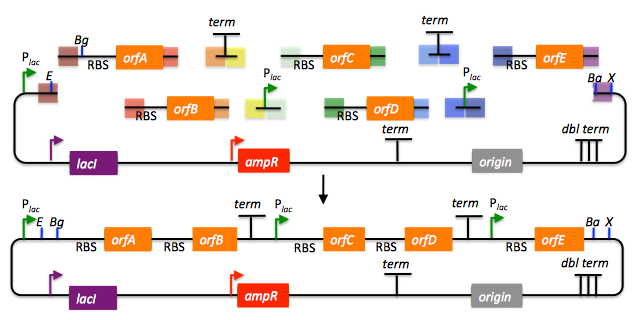

##The SLIC, Gibson, CPEC and SLiCE assembly methods (and GeneArt Seamless Cloning)

SLIC, Gibson, CPEC, and SLiCE are related methods that offer standardized, scarless, (largely) sequence-independent, multi-part DNA assembly. Since the starting materials and final products are the same for these three methods, TeselaGen BETA provides a single design process for all of them. Some discussion of the advantages of each method over the others is provided below.

#### SLIC

SLIC, or sequence and ligase independent cloning ([Li 2007](http://www.nature.com/nmeth/journal/v4/n3/abs/nmeth1010.html)), as its name implies, does not utilize restriction enzymes or ligase (see also the "Experimental protocols" section of this manual which contains a variation of the SLIC protocol). A DNA sequence fragment to be cloned into a destination vector is PCR amplified with oligos whose 5' termini contain about 25 bp of sequence homology to the ends of the destination vector, linearized either by restriction digest or PCR amplification. Sequence homology regions are depicted in white and grey in the figure below.

SLIC assembly of partA with a linearized destination vector:

The linearized destination vector and the PCR product containing partA are separately treated with T4 DNA polymerase in the absence of dNTPs. In the absence of dNTPs, T4 DNA polymerase has 3' exonuclease activity, which begins to chew-back the linearized destination vector and the PCR product from 3' to 5'. Once the termini of the linearized destination vector and the PCR product have sufficient complementary single-stranded 5' overhangs exposed, dCTP is added to arrest the chew-back reaction. With the addition of dCTP, the T4 DNA polymerase changes activity from 3' exonuclease to polymerase, but stalls because not all dNTPs are present, retaining most, if not the entirety, of each chewed-back overhang. Alternatives to the 3' chew-back with T4 DNA polymerase in the absence of dNTPs include the use of mixed or incomplete PCR products (so this does not apply to the linearized vector backbone if it is derived from a restriction enzyme digest), which can also result in the desired 5' overhangs, as described in the original SLIC publication ([Li 2007](http://www.nature.com/nmeth/journal/v4/n3/abs/nmeth1010.html)).The chewed-back linearized destination vector and PCR product are mixed together, and annealed to each other. Since there is no ligase in the reaction, this results in a plasmid with four single stranded gaps or nicks. Once transformed into competent _E. coli_, the gaps are repaired. Note that SLIC assembly is standardized, in that it always uses the same reaction components and conditions, scar-less, since there is no sequence in the resulting assembly that is not user-designed, and sequence-independent, as the method is not (at least to a large extent, but see below) sensitive to the sequences of either the destination vector or the part to be incorporated.

#### Gibson

Gibson DNA assembly, so named after the developer of the method ([Gibson 2009](http://www.nature.com/nmeth/journal/v6/n5/abs/nmeth.1318.html)), is analogous to SLIC, except that it uses a dedicated exonuclease (no dNTP addition step), and uses a ligase to seal the single stranded nicks (see also the "Experimental protocols" section of this manual which contains a variation of the Gibson protocol).

Gibson assembly of partA with a linearized destination vector:

The linearized destination vector and the PCR product containing partA are mixed together with T5 exonuclease, which chews-back the linearized destination vector and the PCR product from 5' to 3', Phusion polymerase, which (with the annealed linearized destination vector and PCR product effectively priming each other) fills in the gaps, and ligase, which seals the four single stranded nicks. The polymerase chases the exonuclease around the plasmid, with the polymerase eventually overtaking, as the exonuclease is gradually heat-inactivated (and Phusion is extremely fast). Like SLIC, Gibson assembly is standardized, scar-less, and largely sequence-independent. Gibson is advantageous over SLIC in that it is a simultaneous one pot reaction (the two-step addition of dCTP is not required), the presence of ligase may boost assembly efficiency, and since the assembly reaction occurs at an elevated temperature relative to SLIC, there may be fewer problems when somewhat stable secondary structures occur at the ends of assembly pieces; the disadvantage of the Gibson method is that the T5 exonuclease, Phusion polymerase, and Taq ligase cocktail is more expensive than that required for SLIC (only T4 DNA polymerase, or none at all if mixed or incomplete PCR products are used). An anecdotal/empirical limitation of the Gibson method is that it works best to assemble DNA fragments that are at least 250 bp in length or longer; this is perhaps due to the likelihood that the T5 exonuclease would entirely chew through a short DNA fragment before it has a chance to anneal and prime the Phusion polymerase for extension. While the same could be said for SLIC, the timing of dCTP addition provides some control in switching from the exonuclease to the polymerase activity of T4 DNA polymerase (the use of mixed or incomplete PCR products can prevent this problem all together), although caution should be applied when using SLIC to assemble small DNA fragments. Prior to Gibson (or SLIC) assembly, it is recommended to SOE (splice by overlap extension) together neighboring assembly fragments until their cumulative size is larger than 250 bp. Fortunately, the very same PCR products designed for Gibson (and SLIC) assembly, already contain the flanking homology sequences required for SOEing. It has also been observed anecdotally that adding a 5-fold molar excess of fragments less than 250 bp in length can also address the issue.

#### CPEC

CPEC, or circular polymerase extension cloning ([Quan 2009](http://www.plosone.org/article/info%3Adoi%2F10.1371%2Fjournal.pone.0006441)), is analogous to SOEing together the fragments to be assembled, except that no oligos are utilized (the linearized destination vector and PCR product prime each other, as in SLIC/Gibson assembly) and there are typically only a few thermo-cycles required (see also the "Experimental protocols" section of this manual which contains a variation of the CPEC protocol).

CPEC assembly of partA with a linearized destination vector:

Since there are no (or very few) re-amplifications of a given template sequence, PCR-derived mutations are not propagated to the same extent as one would anticipate for standard SOEing reactions. Like SLIC and Gibson assembly, CPEC is standardized, scar-less, and largely sequence-independent. CPEC is advantageous in that, since there is no exonuclease chew-back, small sequence fragments can be assembled directly without a preliminary SOEing step, there is no dNTP addition step (unlike SLIC), there is only a single enzyme (polymerase) required (unlike Gibson), and since the CPEC assembly reaction occurs at higher temperatures than either SLIC or Gibson, stable secondary structures at the ends of assembly pieces are relatively less of a concern. The main disadvantages of CPEC is that it is more likely to result in polymerase-derived mutations than SLIC or Gibson, and mis-priming events are now possible anywhere along the sequences of the fragments to be assembled (as opposed to only at the termini of the fragments), although the Gibson method, depending on how much of a head start the T5 exonuclease has, could suffer from similar drawbacks.

#### SLiCE

SLiCE (Seamless Ligation Cloning Extract, [Zhang 2012](http://www.ncbi.nlm.nih.gov/pmc/articles/PMC3333860/)) uses the same types of DNA starting materials as those used for SLIC, Gibson, and CPEC (described above), and results in the same final product. Unlike SLIC, Gibson, or CPEC, however, SLiCE utilizes bacterial cell extract (i.e., an ex vivo DNA assembly method) making it potentially very cost effective since laboratory bacterial strains can be used as sources for the SLiCE extract. A variation of the SLiCE method, which utilizes PPY, a strain of E. coli DH10B that expresses a lambda-red recombination system, as the source of the extract, has been demonstrated to increase the efficiency of SLiCE. For additional information, please see the "Experimental protocols" section of this manual which contains a variation of the SLiCE protocol.

#### SLIC/Gibson/CPEC/SLiCE similarities

Despite their differences in implementation, SLIC, Gibson, CPEC, and SLiCE assembly methods all start with the same starting materials and result in the same final products:

Thus, an assembly designed for CPEC will be equally applicable to SLIC, Gibson, or SLiCE assembly. Returning to the previous DNA assembly challenge, here's how we could use SLIC/Gibson/CPEC/SLiCE assembly to put together the pathway:

In this example, each homology region is color-coded, from red to violet, in an analogous fashion to the white and grey homology region coloring in the previous single part SLIC/Gibson/CPEC/SLiCE examples above. It should be noted that with SLIC/Gibson/CPEC/SLiCE, unlike BioBrick assembly, we can put together many parts at the same time in the same pot (multi-part assembly). Consequences of multi-part, in contrast with hierarchical binary BioBrick, assembly is that we have immediate access to each and every part to be assembled, and with only one transformation step, combinatorially generated diversity is captured a single time. As shown in this example, we can use SLIC/Gibson/CPEC/SLiCE assembly to generate a BioBrick (BglBrick) vector, although since we didn't use BioBrick assembly during the construction process, we did not introduce any undesirable scar sequences. The downside of SLIC/Gibson/CPEC/SLiCE assembly is that we must now design the 5' flanking homology sequence of each oligo specifically for each assembly junction, a process that can be tedious, laborious, and error-prone.

#### SLIC/Gibson/CPEC/SLiCE limitations and obstacles

A major limitation to SLIC/Gibson/CPEC/SLiCE assembly is that the termini of the DNA sequence fragments to be assembled should not have stable single stranded DNA secondary structure, such as a hairpin or a stem loop (as might be anticipated to occur within a terminator sequence), as this would directly compete with the required single-stranded annealing/priming of neighboring assembly fragments. To some extent, it may be possible to mitigate this by padding these problematic termini with sequence from their neighboring assembly fragments. Repeated sequences (such as the repeated terminators and promoters in the example above) are often obstacles to SLIC/Gibson/CPEC/SLiCE assembly, since assembly is directed by sequence homology, and if two distinct assembly fragments are identical at one terminus (such as the 3' termini of the terminators in the example above), this can lead to assemblies that do not contain all of the desired parts, or may contain parts arranged in the wrong order. To circumvent these obstacles, which j5 refers to as assembly fragment incompatibilities, it is often necessary to perform a sequential hierarchical assembly so as not to place assembly fragments with identical termini in the same assembly reaction at the same time. When ever possible, it is highly preferred to substitute repeated sequences with sequence pairs that are not identical, yet encode comparable biological function; this provides a benefit not only to the DNA assembly process, but will also enhance the DNA stability of the resulting construct. Finally, SLIC/Gibson/CPEC/SLiCE might not be the optimal choice for combinatorial assembly if sequence diversity occurs at the very ends of the sequence fragments to be assembled (within about 15 bps of the termini), since this will preclude the reuse of the same homology sequences throughout all of the combinations. However, in certain situations, combinatorial SLIC/Gibson/CPEC/SLiCE assembly can be a very reasonable and effective choice (see for example ([Ramon 2010](http://www.ncbi.nlm.nih.gov/pubmed/21107654)) for Gibson and ([Quan 2011](http://www.ncbi.nlm.nih.gov/pubmed/21293463)) for CPEC), if the sequence identity throughout all combinations and assembly junctions is extensive enough not to be a limitation. These limitations, which assert that the SLIC/Gibson/CPEC/SLiCE assembly methods are not completely sequence-independent, are largely addressed by the Golden-gate assembly method.

#### GeneArt® Seamless Cloning

GeneArt® Seamless Cloning is a proprietary assembly methodology developed by [Life Technologies](http://www.lifetechnologies.com/us/en/home.html). This assembly method uses the same types of DNA starting materials as those used for SLIC/Gibson/CPEC/SLiCE (described above), and results in the same final product. One key difference is that the recommended overlap length is only 15 bps (enabled by a room temperature assembly reaction), which may prove advantageous over SLIC/Gibson/CPEC/SLiCE from the standpoint of requiring shorter/cheaper DNA oligos and enabling combinatorial assembly designs with sequence diversity close to the ends of the sequence fragments to be assembled. On the other hand, a shorter overlap length may reduce assembly specificity, and depending on the assembly mechanism (proprietary), high self complementarity or strong single stranded DNA secondary structure in the overlap region may prove more problematic than for SLIC/Gibson/CPEC/SLiCE. Since the overlap length is shorter (~15 bps) than that generally recommended for SLIC/Gibson/CPEC/SLiCE (~25 bps), applying the SLIC/Gibson/CPEC/SLiCE methods to DNA fragments optimized for GeneArt® Seamless Cloning may not be successful. As described in the "SLIC, Gibson, CPEC assembly (and GeneArt® Seamless Cloning)" sub-section of this manual, it is necessary to modify the j5 design parameters to optimize assemblies for GeneArt® Seamless Cloning. For more information, see the [GeneArt® Seamless Cloning documentation](http://www.invitrogen.com/site/us/en/home/Products-and-Services/Applications/Cloning/Seamless-Cloning-and-Genetic-Assembly/Geneart-Seamless-Cloning-and-Assembly.html) on the Life Technologies website.
