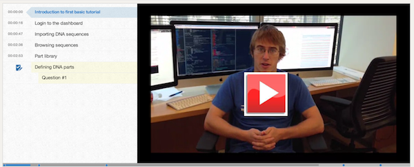

## DNA Sequence and Part Management

#### Demonstration video:

Here is a demonstration video that goes through the process of importing and managing DNA sequences and parts:

#### Narrative:

###### Sequence library

The first thing you'll see upon logging in to TeselaGen is the dashboard. This is a jumping-off point for anything you'd like to do within the app. There are shortcuts allowing you to create a new project, a new sequence, or to get help on how to use our software. There is also a summary view of the data you have saved, with a count of your projects, parts, designs, and DNA sequences.

In the sequence library you can find a repository of DNA sequences that the user has uploaded to the server. Sequences represent any piece of DNA, whether it's a plasmid you have in the fridge or a construct you intend to produce with an assembly. 

I'll grab a folder containing about 30 genbank files and drag them into the sequence library. You'll notice that a progress bar appears in the top of the screen, and the sequences have started appearing in the library. What's happening here is that all the genbank files are being parsed by our software and uploaded to the server. Along with the GenBank locus name of each sequence, we're displaying the sequence length, the names of any annotations that may be present in the file, as well as the date each sequence was created and last modified.

This window summarizes the results of the batch import. It displays the name of each file and the sequence that it contains, as well as any errors or warnings that may have occurred during the parsing process. I'll scroll through, and it looks like most of the sequences were parsed successfully. You can see this file 'pCMTHC.gb' had some parsing errors. What this message is saying is that the file contained some annotations that did not have a 'label' attribute. This just means that when the sequence is rendered, there will be some features that do not have names. The sequence was still parsed successfully, so we don't need to worry too much about that.

Moving on, you'll see that the file 'pSY49.gb' has an error message as well. It appears that pSY49.gb was identical to another sequence file that we already imported. Looks like files pSY49.gb and pRG2.gb are the same. Our software doesn't allow two sequences to be present with the same GenBank LOCUS name and sequence content. If we really wanted both of these sequences to be in the database, we would have to open up a text editor and edit the GenBank locus name of one of them so that they weren’t identical.

Now we can browse through the sequences. As I mouse over each sequence, a preview window pops up showing the sequence along with its annotations, if any are present. Notice that the preview also indicates whether a sequence is linear or circular. We can also search through our sequence library and sort based on their names, length, and dates created and last modified.

###### Part library
Now let's take a look at the part library. Parts are what you will put together into designs and are subsets of sequences. Each part belongs to a single sequence in the sequence library. A part can be a chunk of that sequence, or it can be the entire sequence. A part often represents one functional piece of DNA, such as a promoter, a RBS, or a coding sequence. However, each part can represent whatever you want it to be. You don't import parts into the library - you make them from sequences, but more on that in the next video. As I mouse-over parts, you can see that the sequence they belong to is rendered as a preview. The part itself is shown as a blue selected area in the sequence.