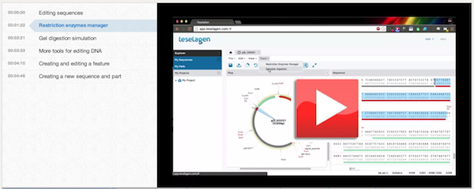

## Sequence Editing and Part Creation

#### Demonstration video:

Here is a demonstration video that goes through this process:

#### Narrative

Selecting a sequence from the sequence library to edit is as simple as clicking on a sequence.
What you can see by opening a sequence, is a circular view of the plasmid, along with a rendering of its annotations and their names. This view here is what we call the map view, and the panel on the right is the sequence view. If you've used DNA editing software before, this should look pretty familiar.

We can select portions of the sequence in either the map or the sequence view, just by clicking and dragging. By default, selections lock to the starts or ends of annotations in the map view, but you can select any sequence by holding control while you select, or you can select in the sequence view. You can fine-tune selections by dragging the edges of the selection in the sequence view.

By default, vector editor only displays features and their labels, but this can be changed in the view menu. In the view menu, you can toggle display of features, restriction enzyme cut sites, and orfs. We can also toggle the display of amino acid sequences in the sequence view. There are shortcuts to display features, cut sites, and orfs in the toolbar as well.

You'll notice that mousing over features, cut sites, orfs, or their labels will give you a more detailed description of them, and clicking them causes their positions in the sequence to be selected. 

Let's take a look at some of the sequence analysis tools available to us. In the tools menu, we have a restriction enzymes manager and a digestion simulator. (Open up the restriction enzymes manager.) Opening up the restriction enzymes manager will show us two lists of enzymes. On the right we have all the enzymes whose cut sites will be displayed if we click the ‘show cut sites’ button, and on the left we have a list of available enzymes. We can scroll through some common groups, such as BioBrick, BglBrick, and so on. Let's say we wanted to only view cut sites for BioBrick enzymes. We'll select that group, get rid of all the enzymes in our current group, and click the add all button. (Select BioBrick, add all to the right list.) Now you can see the enzymes appeared on the right. We can customize the group by adding enzymes from other lists if we so desire. (Select a different enzyme list, add another enzyme to the active group.) To save this group for later use, we can click 'copy group,' and enter a name for the group to be saved. (Click copy group, save the group.) Then we can load this group of enzymes later.

Clicking 'save,' and then closing the window, we'll see that cut sites are being shown only for enzymes in our group. (Open the digestion simulator.) Another tool available to us is the digestion simulator. This will simulate the results of a gel digest on our sequence with the selected enzymes. The interface to the digestion simulator is similar to the restriction enzyme manager. On the left you have a list of enzymes that are available to simulate digestion with, and on the right there is a list of enzymes that are currently being used to simulate the digestion. As in the enzyme manager, we can change lists and search through available enzymes.

I’ll simulate a digestion with the BioBrick set of enzymes. (Select MIT BioBrick Group.) Notice that we display the results of the digestion in this right panel. We get one band near 5300 bp. This is to be expected, since we only have one cut site in our sequence for these enzymes. If I mouse over the band, I can see that this cut site is a result of SpeI cutting from bases 3703 to 3709. Now I’ll add an enzyme to the active list. Maybe I also want to digest with SacI. (Open Common Enzymes List, search for Sac, click SacI.) Now we have three bands in our digestion simulator. If I want more detail, I can change our ladder to the 100 to 3000 basepair version, and I can see more accurately the size of each band.

Under the edit menu, we have tools for selecting, finding, and altering your sequence. We have familiar features like cut, copy, paste, and undo and redo. We can toggle safe editing, which warns you if you try to change the sequence of an annotation, like this. (Try to modify the sequence of a feature.) I'll try to delete a base in a feature, and it will pop up with a window asking me if I want to remove the feature, or keep it there in its altered state.

###### Searching for a DNA sequence
We can search within the DNA or Amino Acid sequence, using either literal search, which only allows a's, t's, c's, or g's for DNA search and amino acid letters for amino acid search, or ambiguous, which allows characters like n to represent all the bases, and so on.

We can also toggle whether we want the sequence to be saved as linear or circular, or we can reset the first basepair of the sequence using 'rotate to here.' This will change the origin of the sequence to be the location of the cursor.

If we want to create a new feature, we can select a portion of the sequence, and right click our selection. (Select some of the sequence, right click -> annotate as new feature.) Clicking the 'annotate as new sequence feature' option will bring up a window allowing us to specify the name and location of the feature, as well any additional attributes we want it to have. (Fill in the window with some dummy data, add a note or two.) We can also change the feature’s type. This is an attribute with a number of different options that describes the feature’s function. We can call our feature a coding sequence, promoter, ribosome binding site, or any one of a number of common types.

###### Editing a feature
Features can also be edited by right clicking on them and selecting the 'edit' option. We can modify their name, type, location, and so on.

Now let's make a new sequence. If we go to file, and then 'open sequence file,' we can select a sequence file to upload. (Upload pProSrfp.gb.) We can overwrite the current sequence or make a new one. Let's make a new one. The name field will automatically take on the value of the locus name, but we can modify it if we want. Now we'll see the new sequence opened in another tab. If we click the save button, the sequence will now be in our sequence library.

What if we want to make a part out of our sequence? It's as simple as selecting a portion of the sequence, then clicking the create part button in the toolbar. Maybe we want to make a part from RFP. We'll select the RFP feature and click on the create part button. (Select RFP, click create part.) In this window we can specify a part name, it's position in the source sequence, and which strand we want it on. We can also decide if we want the part to be mapped to the whole sequence or just a part of it. We'll keep the part as it is and save it.

Now, if we close our sequence tab and go to the part library, we'll see our new RFP part. Clicking on it will open a new vector editor window with our part selected.

