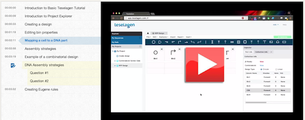

## Designing with Device Editor

#### Demonstration video:

Here is a demonstration video that goes through this process:

#### Narrative

Here you'll see the dashboard again. On the left, under the sequence and part libraries, there's a section called 'My Projects'. Under this is what we call the project explorer. There is one project here already, as you can see. Projects are like folders on a computer- they hold things and help keep you organized. Our projects contain designs, which you can see when I click on the project. This project has one design in it, called Combinatorial Golden Gate. We create a new design, and call it 'RFP Design’. 

The new tab opens, where you can see a blank design. The main panel shows us the content of the design, while the inspector panel on the right displays extra information associated with it. We can see that there is one bin currently in the design.

Let’s create a prototype design. These icons at the top are SBOL visual icons. A bin’s icon doesn’t change its effect on the design, but it does help us understand what the bin’s function is meant to be. The first bin in our design will hold the vector backbone, so we give the bin an origin of replication icon. 

Now we’ll add a few more bins, since a design with only a backbone isn’t very exciting. Let’s say our design consists of a backbone, promoter, coding sequence, and a terminator. We’ll give this bin a more informative name by double-clicking its row in the inspector panel. Notice that I can also edit a few of the bin’s other options. I can define the bin’s forced relative overhang, extend it at the 5-prime or 3-prime ends, or add a direct synthesis firewall.

So if we forget to add an RBS to my design- no big deal, we just add it behind the promoter like this. If we want, we can change the assembly orientation of individual bins. Maybe we want to assemble the CDS on the reverse complement strand of our construct- we can either click the arrow button or select the orientation from the drop-down menu in the inspector. We can also change the geometry of our final construct with the click of a button. Since we’re building a plasmid, we leave this set to the circular option.