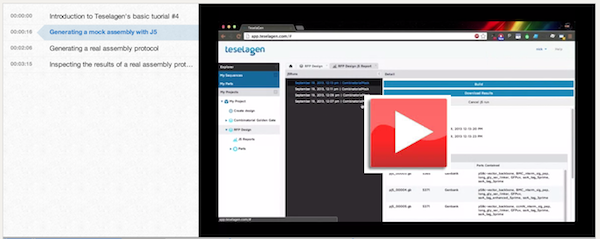

## Generating assembly instructions with J5

#### Demonstration video:

Here is a demonstration video that goes through this process:

#### Narrative:

You can see the combinatorial golden gate assembly example design here. To start off with j5, let's switch to the j5 tab in the inspector panel.

In the assembly method selector, you’ll see that the default method is a mock assembly. This is the first thing you’ll usually want to do with j5 with a new design. In a mock assembly, j5 outputs only the constructs that would result from your design, but does not optimize for a specific assembly protocol. This is a rapid way for you to preview your constructs and refine your design without having to worry about the full experimental protocol details. We’ll run the mock assembly generation, and you’ll see that j5 is working. Now you can see that the j5 run has completed. Clicking on the notification brings us to the j5 reports panel, where we can see the results of all previous j5 runs on this design. Here we can see some summary data about the j5 run, such as the assembly type, run status, and date submitted and finished. There is a warnings panel to show us any messages that j5 output during the run. There is also a grid displaying the constructs that will be assembled from the design.

Notice that there are only 6 plasmids out of the total 8 possible from our design. This is because of the Eugene Rule that we added which prevents two of the designs from being constructed. Displayed with each plasmid’s name and size we have the name of all the parts contained in the plasmid. Looking through the lists of features we can see that none of these assemblies contain both the BMC signal peptide and the short linker. If we want to verify that the design of a plasmid is correct, we can open it by clicking on its row in the table.

Now we can see our first construct. Maybe we want to verify that our parts are all in frame - if we click the ‘show orfs’ icon, we'll see an open reading frame that contains our BMC signal peptide, followed by our linker, then GFP, and finally our degradation tag.

Now that we’ve verified that our plasmids are correctly designed, we can generate a real assembly protocol. Going back to our design, we’ll tell j5 to generate a protocol for a Golden Gate assembly of our design. If we want, we can also modify the j5 parameters. Here we can see the various parameters that j5 uses to optimize assemblies. We can change reaction-specific parameters, like the overlap size in a Gibson reaction, or general parameters like the price we pay per base to synthesize oligonucleotides. Maybe we have a really good deal on DNA synthesis, and it costs us 20 cents per base. This will cause j5 to more heavily favor direct synthesis of assembly pieces. We can also reset our parameters to the default values or our last used configuration. 

Let's reset the parameters to default and run j5.  This will take a bit longer than the mock assembly, since j5 actually has to create an assembly protocol. If we wanted, we could close the browser and come back, and the j5 run would appear in the j5 reports section when it was finished. Now is the time to go grab a cup of coffee while you wait.

Now that our Golden Gate j5 run has finished, we can inspect the results. It looks the same as our mock assembly, but if we download the results we will see that we have a real assembly protocol. This will download a zip file containing our assembly protocol. The zip file contains all the information we need to assemble our combinatorial library. Within this directory are genbank files containing the sequence of each plasmid, along with csv files detailing each plasmid’s assembly instructions. We’ll open up one of these and go through it.

Here we can see the parameters that j5 was run under. Below that is a list of all parts in our design, along with their ID numbers. These IDs are unique to each part within the design. Note that this is a list of all parts in the design, not just in the current plasmid. Below this list, we can see the order and assembly strategy of the parts in this plasmid. J5 has decided that all parts in this plasmid will be embedded in PCR primers, except for the vector backbone and GFP, which will be PCR’d.

Next is a list of oligos which will be synthesized. We will have 4 oligos in this assembly reaction, two for each PCR reaction. Notice that this oligo’s name reveals its purpose. It is the reverse complement primer for the vector backbone PCR reaction, and has the BMC part embedded in it. The next two oligos are the primers for the GFP PCR reaction, and have the rest of the parts embedded in them.

Below the oligo synthesis list is the list of PCR reactions we will have to run. We’re given the template sequence, forward and reverse primer names, and product sequences for each reaction. The first PCR targets parts 0-1, referring to the vector backbone and BMC signal peptide, and the second targets parts 2-5, the four remaining parts in the plasmid.

Finally, we can see the assembly pieces that will be combined in the Golden Gate reaction. These are the products from the two PCR reactions in the previous list. When the Golden Gate reaction is completed, we’ll be left with a product that has the sequence shown here.

In addition to generating assembly protocols for single designs, j5 can condense multiple output files into a single assembly file. This aggregation makes it easier to produce multiple assemblies at the same time, for example on 96 well plates by sharing oligos that are common to multiple designs and optimizing for space usage.