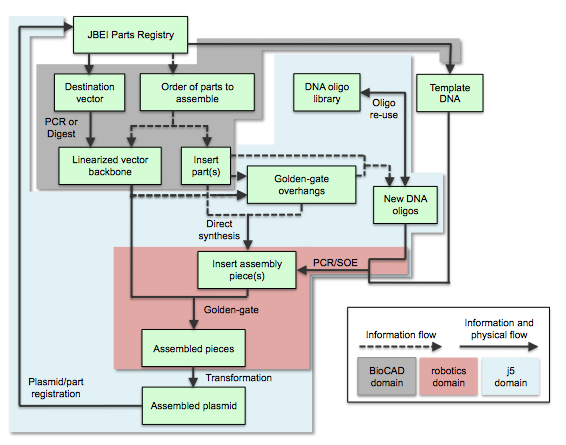

## Process flow for j5 and integration with Registries of Biological Parts and BioCAD tools

Here is the process flow for j5-designed SLIC/Gibson/CPEC/SLiCE assembly:

A researcher begins the DNA assembly process by selecting parts to assemble from a Registry of Biological Parts (e.g. the [JBEI Parts Registry](https://public-registry.jbei.org/)) or a local collection of DNA sequences. BioCAD (biological computer-aided design) tools may assist this process; specifically, to the benefit of SLIC/Gibson/CPEC/SLiCE BioBrick-compatible assembly, BioCAD tools can: 1) suggest viable alternatives to undesirable repeated homologous sequences (e.g. identifying two distinct terminators with comparable function), 2) suggest point mutations to make that disrupt internal BioBrick/BsaI restriction sites [while we are working towards a seamless automated integration of j5 with the JBEI Registry and BioCAD tools such those built upon the Clotho platform ([Xia 2011](http://www.ncbi.nlm.nih.gov/pubmed/21601675)), the information flow between these three domains currently remains a predominantly manual process], and 3) query collections of DNA sequences for [physically existing and available] sequences that already contain two or more of the parts to be assembled together in the proper order and proper orientation, reducing redundant fragment assembly steps where at all possible [this feature is being developed for j5, as it becomes more tightly integrated with the JBEI Registry platform]. The parts to assemble are categorized into either the linearized destination vector, or insert parts. The linearized destination vector is nominally physically achieved by digesting the destination vector with restriction enzymes or by PCR-amplifying the vector backbone, although direct DNA synthesis of an entire vector backbone is an option. Given the sequences of the linearized vector backbone and the insert parts, j5 designs the flanking homology sequences for each assembly piece, and performs an analysis to determine for which (if any) portions of the assembly direct synthesis would be more cost-effective than either PCR/SOE or oligo embedding. j5 then designs DNA oligos for synthesis, and/or suggests re-use of existing oligos where possible, to amplify the desired assembly pieces. Note that the vector backbone and/or any of the insert parts to be assembled do not necessarily need to physically exist (a prerequisite endonuclease digestion or PCR amplification) before using j5 to design the assembly, since it is possible to specify a direct synthesis strategy for any assembly fragment (see the Target Part Order List File documentation for more information). Liquid handling robotics or other devices may assist the execution of PCR/SOE to generate the assembly pieces, as well as their subsequent SLIC/Gibson/CPEC/SLiCE assembly. j5 facilitates this process by condensing/aggregating designs for multiple independent assemblies into multi-well plate format including optimally distributing reactions across a thermo-cycler annealing temperature gradient. After transforming a competent cloning strain with the assembly reaction, a clonal isolate of the assembled plasmid is sequence verified, and then deposited into the parts registry or local collection for subsequent re-use.

Here is the process flow for j5-designed Golden Gate assembly:

The Golden Gate process is completely analogous to the SLIC/Gibson/CPEC/SLiCE assembly flow described above, with the design of the 4 bp overhang sequences substituting for the design of the flanking homology sequences.
