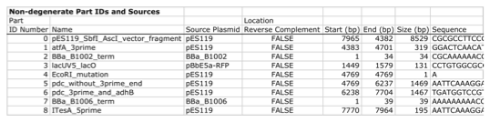
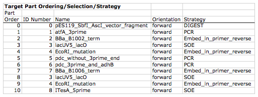
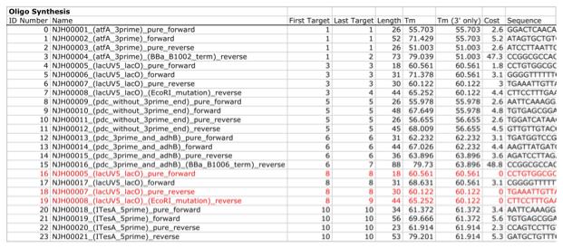
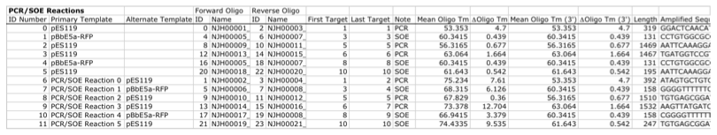
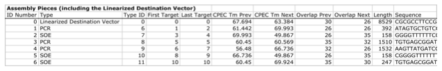
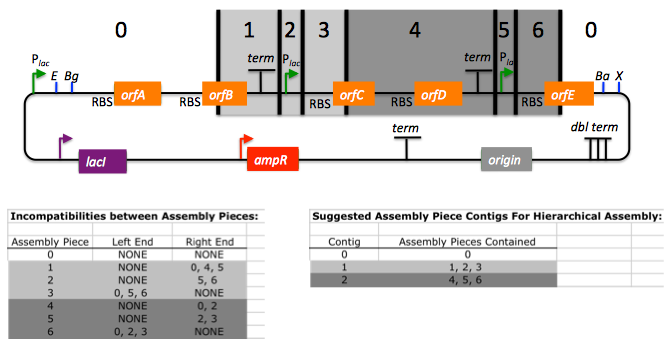
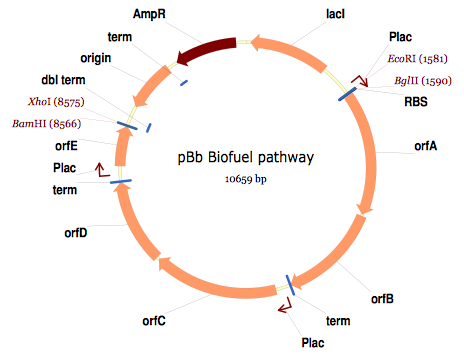

## Brief survey of j5 functionality

For additional information, please refer to the j5 paper ([Hillson, 2011](http://pubs.acs.org/doi/abs/10.1021/sb2000116)).

As described in the process flow for j5, given the (putatively combinatorial) sequences of the linearized vector backbone and the insert parts, j5 designs SLIC/Gibson/CPEC/SLiCE flanking homology sequences or Golden Gate overhangs for each assembly piece, and performs an analysis to determine for which (if any) portions of the assembly direct synthesis would be more cost-effective than either PCR/SOE or oligo embedding. j5 then designs the resulting DNA sequences for cost-effective direct synthesis, as well as the DNA oligos (suggesting re-use of existing oligos where possible) to amplify the desired assembly pieces. Finally, j5 outputs the PCR reactions to perform, details the resulting DNA sequences that will be assembled together, checks for any incompatibilities between the assembly pieces, and prepares an annotated sequence file for the resulting assembly. Thus, j5 automates the tedious, laborious, and error-prone portions of the DNA assembly design process. Furthermore, j5 condenses/aggregates multiple independent assembly designs (into 96-well plate format [including optimally distributing reactions across a thermo-cycler annealing temperature gradient]), facilitating the execution of assembly protocols utilizing liquid handling robotics.

The following survey provides a brief overview of a typical j5 SLIC/Gibson/CPEC/SLiCE assembly design process, and then goes on to highlight a few j5 functionalities relating to Golden Gate assembly design, combinatorial assembly design, and condensing multiple assembly designs. Specific detailed step-by-step examples of how to use j5 are provided in the next section.

The j5 assembly design process begins with the definition of the biological parts (sequences) to be assembled. Since j5 designs for the SLIC/Gibson/CPEC/SLiCE and Golden-gate assembly methods that are largely sequence independent, the defined parts do not need to be "packaged" in any particular format (as would be required for BioBricks, for example).

Here is a typical list of defined parts (these would have been defined in a j5 parts list input file):

In essence, a part is merely defined by a start and end base pair within a source sequence, and by its location on the top or bottom (reverse complement) strand. 

Following the definitions of the parts to be assembled, the next step is to order and set the direction (forward or reverse) of each of the parts to be assembled together in the final target construct.

Here is a typical list of ordered parts to be assembled (the order and direction of each part would have been defined in a j5 target part order list input file):

For this particular assembly, the vector backbone (the very first part in the list) will be restriction digest linearized to yield the first assembly piece. The primary advantages of using a digest linearized vector backbone (over PCR amplification) are that PCR amplification of a (potentially) long vector backbone sequence is not required, and point mutations that may be introduced into the vector backbone during PCR amplification are not a concern. As a consequence, deep sequencing into the digest linearized vector backbone is not required (although sequence verification of the vector backbone junctions with the other assembly pieces is still necessary). The main disadvantages of a restriction digest linearized vector backbone are that, first and foremost, it requires a (unique) cut-site which diminishes the sequence-independence of the assembly process, and second that it places the entire SLIC/Gibson/CPEC/SLiCE sequence homology/overlap burden on the adjacent assembly pieces. For example, we must flank the 5' end of the first DNA part to follow the digest linearized vector backbone (in this specific example, the 3' end of the atfA gene) with the entire homology region (e.g. the last 26 bps of the linearized vector backbone). If, in contrast, we were to PCR amplify the vector backbone, we could share the SLIC/Gibson/CPEC/SLiCE sequence homology/overlap burden more equally between the linearized vector backbone and the neighboring assembly pieces (e.g. flanking only about 13 bps of homology sequence to the ends of the linearized vector backbone and first assembly pieces), and we would not require a cut-site to linearize the backbone. In the case of Golden Gate assembly, the main disadvantage of restriction digest backbone linearization is that it requires a Golden Gate specific entry vector with prescribed Golden Gate overhangs (which may greatly constrain the Golden Gate assembly design process).

One of j5's tasks is to find the most cost-effective assembly design (the parameters used in the cost analysis are defined in the j5 parameters file). While the user may specify a strategy for each part (such as dictating that the vector backbone will be digest linearized in this particular example, see the target part order list documentation for more information), j5 has to determine for all parts with unspecified strategy if direct DNA synthesis, PCR/SOE, or oligo embedding is the best approach from a cost standpoint. In this particular example, with the exception of the digested vector backbone, all of the larger parts will be PCR amplified, the intermediate parts (too small for direct Gibson assembly) will be PCR amplified and then SOE'd together with neighboring parts until a sufficient assembly piece size is obtained (e.g. ~250 bp), and the very small parts will be directly embedded into the primers that amplify the intermediate or large parts. While direct DNA synthesis is not cost effective in this particular example, as direct synthesis costs continue to fall, it is anticipated that it will play a dominant role in j5 designed assemblies in the near future.

In addition to digest, PCR/SOE, oligo embedding, or direct DNA synthesis assembly strategies, j5 now offers the user the option of specifying that a part should be incorporated into the assembly via a pair of annealed DNA oligos. The basic idea is that two designed complementary DNA oligos can be mixed together, heated up, and then annealed together to yield a double stranded DNA fragment that can serve as an input for the assembly process. This option is most appropriate for parts around 30 bps (SLIC/Gibson/CPEC/SLiCE) to 60 bps (Golden Gate) that are too small to be PCR'd and too large to be cost-effectively embedded within a primer (as it would lead to the primer being longer than 60bps and thus requiring expensive PAGE purification and/or larger oligo synthesis scales). For SLIC/Gibson/CPEC/SLiCE assembly, the two oligos anneal to yield a blunt double-stranded DNA fragment that contains the part as well as the designed flanking homology sequences. For Golden Gate assembly, the two oligos anneal to yield a double-stranded DNA fragment that contains the part flanked by the designed 5' overhangs (i.e. no type IIs digestion required). For Golden Gate assembly, it is recommended that the oligos are ordered 5' phosphorylated, or phosphorylated as described in the protocols section, to promote DNA ligation. While j5 does not currently consider the annealed DNA oligos strategy during its cost-optimal assembly design process, this may be implemented in the future. j5 does not currently check for self-complementarity within the oligos to be annealed together, nor off-target annealing locations; these error-prevention features may be implemented in the future. See the target part order list documentation for more information.

Here is a typical list of DNA oligos to be used in an assembly (the designed oligos would be appended to a j5 master oligos list file):

j5 utilizes the Primer3 primer design program in the oligo design process, using design parameters (such as the target Tm) defined in the j5 parameters file. There are two types of primers that j5 designs: 1) "pure" primers that anneal perfectly to the template sequence, and 2) full-length primers that contain a 5' SLIC/Gibson/CPEC/SLiCE flanking homology sequence (or a 5' type IIs endonuclease site followed by a Golden Gate overhang) followed by the identical sequence of the corresponding "pure" primer. By default, j5 does not output these "pure" primers, although you can request that j5 does so by setting the "SUPPRESS_PURE_PRIMERS" j5 parameter to "FALSE" (as specified in the j5 parameters file). The "pure" primers can be useful, for example, when first amplifying from a genomic DNA template, before reamplifying the resulting "pure" PCR product with the full length primers to introduce the flanking SLIC/Gibson/CPEC/SLiCE or Golden Gate sequence required for assembly.

[Note that an alternative to embedding the SLIC/Gibson/CPEC/SLiCE flanking homology sequences within the oligo primers themselves (which can limit the size/length of the homology sequences), is to SOE together the flanking sequences to the 5' and 3' termini of the fragment to be assembled. This can be highly desirable, for example, when designing a protocol for in-vivo yeast assembly using the DNA assembler approach ([Shao 2009](http://www.ncbi.nlm.nih.gov/pubmed/19074487), [Shao 2011](http://www.ncbi.nlm.nih.gov/pubmed/21327279)), which may require long homology sequences (up to several hundreds of bp) which are too long to embed directly into a DNA oligo primer. In addition, in some instances it may be desirable to use SLIC/Gibson/CPEC/SLiCE to assemble (in several PCR-amenable fragments) extremely long physically existing sequences (e.g. a metabolic pathway that is over 10 kb and has already been cloned, or is present in genomic DNA) into additional constructs. In this particular case, it is possible simply to overlap PCR products to generate the necessary flanking homology overlaps, and it is not necessary, then, to include the flanking homology sequences into the DNA oligos nor flank them onto the assembly piece by SOEing. j5 is currently being developed to support the design of DNA assembler (in-vivo yeast assembly) protocols as well as for exploiting the flanking homology sequence that already is present in long physically available sequences.]

j5 automatically names the oligos (with an iterative numbering scheme, based on the part(s) that the oligo anneals to and whether or not the primer is "pure") and checks to see if the designed oligo is already present in a user's oligo collection (defined by the j5 master oligos list file). In this particular example the oligos highlighted in red were already included in the oligo collection, and the previously ordered oligos will be re-used, adding no additional cost to the assembly process.

In the case of either Gibson or CPEC assembly, since flanking SLIC/Gibson/CPEC/SLiCE homology sequences at the termini of the assembly pieces serve to prime neighboring assembly pieces for polymerase extension, j5 additionally uses the Primer3 primer program to design the 5' SLIC/Gibson/CPEC/SLiCE flanking homology sequence portions of the full-length oligos. It is possible to set the desired minimum and maximum Tms for the SLIC/Gibson/CPEC/SLiCE overlaps independently of the desired minimum and maximum Tms for primers, which can be quite useful for GeneArt® Seamless Cloning,  for example, which uses short (~15bp) overlaps.

During the primer design process, if Primer3 is unable to find an acceptable set of primers, j5 relieves Primer3 of the primer design constraints that are leading to the rejection of all considered primers (e.g. minimum Tm and self-complementarity constraints), while still preferring primers that minimize the violation of design constraints. The constraint rank-ordering (first eliminated to last) is as follows: too many Ns, too many poly-X, GC content, minimum Tm, maximum Tm, maximum difference in Tm, self-complementarity, and pair-complementarity.

j5 utilizes BLAST (bl2seq) to check for probable mis-priming events that exceed a minimum Tm threshold (as specified in the j5 parameters file).

With all of the direct DNA synthesis pieces and DNA oligos designed, j5 then outputs the PCR reactions that are required to generate the DNA fragments to be assembled together. Here is a typical list of PCR reactions:

In this particular example, the PCR reactions in the first half of the list use "pure" primers, and those in the the second half use full-length primers. The primary sequence templates of the PCR reactions in the second half of the list are the corresponding "pure" PCR reaction products. j5 suggests that the full-length PCR reactions can alternatively use plasmid templates directly, forgoing the "pure" reactions altogether. If the resulting PCR product size is smaller than the minimum required for Gibson assembly (defined in the j5 parameters file), the PCR reaction is annotated as "SOE", indicating that this PCR product should be SOE'd together with neighboring assembly pieces until the minimum Gibson fragment size is achieved. Since neighboring assembly pieces already contain flanking homology sequence, and the requisite external primers are included in the list of designed oligos above, this SOEing process requires no additional design or new oligos.

j5 then details the resulting DNA pieces that will be assembled together. Here is a typical list of assembly pieces:

j5 provides the number of base pairs of flanking homology sequence shared between neighboring assembly pieces (relevant to SLIC and Gibson assembly) and the Tms of annealing to their neighboring assembly pieces (relevant to CPEC assembly).

An additional task of j5 is to identify SLIC/Gibson/CPEC/SLiCE assembly piece incompatibilities. Since DNA assembly is directed by the flanking homology sequences at the termini of the assembly pieces (see the last figure of the SLIC/Gibson/CPEC/SLiCE documentation section), it is important to check to make sure that two different assembly pieces do not have the same flanking homology sequence. In the case of CPEC, it is additionally important to make sure that flanking homology sequence termini do not anneal to the internal sections of any of the assembly pieces. As is the case for checking for mis-priming events, j5 utilizes BLAST (bl2seq) to check for probable mis-annealing events that exceed a minimum Tm threshold (as specified in the j5 parameters file).

In this particular example, there are incompatibilities amongst the set of assembly pieces, as is often the case when part(s) are used repetitively in the same assembly (here, the Plac promoter part is used twice, and the Plac sequence is also found within the vector backbone). In this particular example, since the 5' ends of assembly pieces 2 and 5 are identical, assembly piece 1 might end up partnering with either assembly piece 2 or 5, resulting in undesired assembly products. j5 identifies these incompatibilities, and suggests a hierarchical assembly process, namely assembling pieces 1, 2 and 3 together, and separately 4, 5, and 6 together, as a preliminary step. Then, piece 0 (white) is assembled together with the contiguous piece containing 1, 2 and 3 (light grey), and with the contig containing 4, 5 and 6 (dark grey).

Here is the list of assembly piece incompatibilities for this particular example, and a suggested hierarchical assembly (for details see j5 SLIC/Gibson/CPEC/SLiCE output documentation):

The final task of j5 is to prepare an annotated sequence file for the resulting assembly. j5 can output sequences in GenBank, FASTA, jbei-seq or SBOL XML format. Any feature annotations found within the sequence files going in to the assembly are correspondingly preserved in the resulting assembled sequence file. j5 will auto-annotate FASTA sequences with a "misc_feature" type feature whose label matches the display ID of the sequence (i.e. what follows the ">").

Here is the map of the resulting j5 designed assembly for this particular example:

The resulting annotated sequence file (and corresponding plasmid map) provides a quick way to check that you will assemble what you actually want.

The process for designing Golden Gate assemblies with j5 is very similar to that described above for SLIC/Gibson/CPEC/SLiCE assembly. The key distinction between the two respective design processes (see their process flow diagrams) is that whereas SLIC/Gibson/CPEC/SLiCE uses sequence homology at the termini of the assembly pieces to direct the assembly process, Golden Gate uses cohesive (generally 4 bp) single stranded overhangs (resulting from type IIs endonuclease digests). Similar to checking for incompatible sequence homology termini when designing for SLIC/Gibson/CPEC/SLiCE, it is essential that Golden Gate assembly designs lack overhangs that are either self-incompatible (i.e. palindromic/self cohesive) or are cross-complementary (i.e. anneal with more than one (the desired) overhang)), as this would lead to off-target assembly products. It is also important to check against incompatibilities with any overhangs that may result from internal type IIs cleavage of the assembly pieces (sites internal to the DNA fragments to be assembled). Analogous to utilizing the annealing Tm of two SLIC/Gibson/CPEC/SLiCE homology sequences to gauge the extent of their incompatibility, the extent of Golden Gate overhang (self-)incompatibility is judged by the number of complementary base pairs shared between the two overhangs. The maximum number of base-pair matches j5 allows between two overhangs that are not intended to be assembled together is determined by the j5 parameters file (the default is that at most 2 of the 4 overhang bp are complementary).

As noted in the Bioinformatics prerequisites section, if BsaI (or another selected type IIs endonuclease) recognition sites are present within the DNA fragments to assemble (not only at the assembly piece termini), assembly may still occur (since the digest/ligation is a reversible-process), but the efficiency will be decreased. j5 currently reports a warning if these sites are encountered in the final assembled vector (see the Golden Gate output file documentation for more information), and avoids selecting overhang sequences which are incompatible with the resulting internal overhangs.

If highly homology sequence repeats are present in a DNA assembly product, they may destabilize the resulting construct in vivo (or potentially during the assembly process depending on the methodology). j5 currently reports a warning if homologous sequences repeats are encountered in the final assembled vector (see the SLIC/Gibson/CPEC/SLiCE output or Golden Gate output file documentation for more information). The criteria (minimum homologous sequence length, and maximum fraction of mismatches) for determining significant homologous sequence repeats are configurable within the set of j5 parameters. Note: warning messages are output only into individual construct j5 output files, and are not output into the combinatorial/condensed j5 output files.

While the default type IIs endonuclease choice for j5 is BsaI, it is possible to modify the default j5 assembly parameters if you would like to use a different endonuclease (e.g. AarI). For more information, see step 7 (concerning the j5 parameters file) in the step-by-step Golden Gate example.

When selecting a set of Golden Gate overhangs for the assembly piece junctions (which is equivalent to selecting the set of relative overhang positions, see the target part order list documentation for a graphical depiction and more information), j5 exhaustively searches through all possible combinations of available overhangs for the assembly junctions and selects the set of overhangs that 1) are compatible with themselves and each other, and that 2) are as neutral as possible. The overhang search space (about the assembly junction) is largely constrained by the maximum oligo size, as non-neutral relative overhang positions result in embedding additional sequence within one of the two affected oligos. Occasionally (usually only if there are many Golden Gate junctions and the sequence regions around the junctions from which to select overhangs are highly constrained), it is possible that j5 can not find a set of overhangs that are compatible with themselves and with each other. In this case, it will be necessary to introduce additional scar base-pairs at one or more assembly junctions, to increase the number and diversity of the overhangs from which to select. It is possible to force j5 to use a particular overhang for a given Golden Gate assembly junction (by setting the relative overhang position for the junction in the target part order list file), although this further constrains the overhang selection process and may increase that chances that j5 is unable to find a compatible set of Golden Gate overhangs.

This brings about the question of why forcibly setting a relative overhang position for Golden Gate assembly might be useful. The most common reasons to set an overhang position are 1) to be able to reuse a DNA oligo primer from a previous Golden Gate assembly (whose embedded type IIs endonuclease recognition site position determines the resulting overhang sequence) to re-amplify a part, and 2) to generate combinatorial Golden Gate libraries, where it is essential that all parts in a given combinatorial bin have the same flanking overhang termini (see the combinatorial Golden-gate description for more information).

The analogous is true for why forcibly setting a relative overlap position for SLIC/Gibson/CPEC/SLiCE assembly might be useful: 1) to be able to reuse a DNA oligo primer from a previous SLIC/Gibson/CPEC/SLiCE assembly to re-amplify a part, and 2) to generate combinatorial SLIC/Gibson/CPEC/SLiCE libraries, where it is essential that all parts in a given combinatorial bin have the same flanking overlap termini (see the combinatorial SLIC/Gibson/CPEC/SLiCE description for more information).

In order to achieve scar-less DNA assemblies, when j5 designs combinatorial SLIC/Gibson/CPEC/SLiCE or Golden Gate assemblies, the overlap/overhang search space about a given combinatorial assembly junction is constrained on the 5' side of the junction by the first (3'-most) non-identical (amongst the parts in the 5' bin) base pair, and similarly on the 3' side of the junction by the first (5'-most) non-identical (amongst the parts in the 3' bin) base pair. Note that ambiguous base pairs (such as 'N'), even if uniform at a given sequence position throughout the parts in a combinatorial bin, are considered to be non-identical sequence positions. The more sequence identity the parts in a bin have at their termini, the less constrained the overhang selection process will be. If the number of identical base pairs adjacent to or spanning the junction is not at least the length of the minimum SLIC/Gibson/CPEC/SLiCE overlap or a Golden Gate overhang, a scar-less assembly for the entire combinatorial library will not be possible if all assembly pieces are to be re-used across all combinations. In this case, to achieve full assembly piece re-use across all combinations (to save cost), it will be necessary to manually add a scar to one or more of the constructs, by inserting an identical base pair(s) to all of the parts at the troublesome assembly junction, or alternatively preserving the parts' lengths, by (silently) mutating a base pair position of a subset of the parts to achieve a singular identity at that sequence position, effectively expanding the identical sequence span. When j5 identifies an over-constrained assembly junction during the combinatorial assembly junction design process, it will issue a warning message (see the combinatorial SLIC/Gibson/CPEC/SLiCE output file documentation for more information) and relax the constraint on the assembly junction that all combinations must have the same overhang/overlap sequence. While this constraint relaxation precludes full assembly piece re-use across all combinations, it does allow j5 to complete the design process.

Another option that is particularly useful when designing combinatorial assemblies with j5 is the use of direct synthesis firewalls. As combinatorial assembly design is currently implemented, j5 first generates a template assembly to design all of the overlaps/overhangs, then it uses the standard (single-construct) design process for each of the instances within the combinatorial library (forcibly setting the overlap/overhang positions based on the results from the template assembly design). Since j5 performs a cost-effective analysis for the use of direct DNA synthesis vs PCR, etc., it could be the case that directly synthesizing two parts (in two contiguous combinatorial bins) together is cheaper than performing the PCR of the two parts separately. Note that if this were the case, one loses the combinatorial assembly benefit of keeping the parts separate. The issue is that currently the cost-effective calculation is based on generating a single construct, and the initial cost of the oligos required for PCR is not properly amortized over the construction cost of the entire library. Until more sophisticated cost calculation is implemented, the best way to address this issue is to enforce a direct synthesis firewall between the two contiguous parts (see the  target part order list file documentation for more information), which effectively prevents j5 from suggesting to directly synthesize the two parts together (they can still be directly synthesized separately, however).

When designing combinatorial assemblies with j5, it is possible to set design specification rules that limit the total number of times a given part appears in a given assembly, if two given parts should not appear together in the same assembly, or if two given parts should only appear together in the same assembly. The design specification rules understood by j5 are derived from the Eugene biological design specification computer language ([Bilitchenko 2011A](http://www.ncbi.nlm.nih.gov/pubmed/21559524), [Bilitchenko 2011B](http://www.ncbi.nlm.nih.gov/pubmed/21601677)) (see the Eugene rules list file documentation for more information).

j5 has the capacity to design mock assemblies, in which j5 outputs the anticipated product(s) of the assembly reaction(s), but does not invest the effort required to design the assembly protocol(s)/process(es) themselves. This is useful functionality from the standpoint that designing mock assemblies can be much faster than designing the actual assembly protocols, and can give the user rapid feedback about the number of constructs that would be produced (i.e. those combinations that satisfy Eugene design specification rules), along with their sequences, for validation before formally submitting the designs to j5 for protocol design.

j5 has the capacity to aggregate multiple assembly designs (excluding Mock assemblies) into a single assembly file. This is extremely useful for combinatorial library assembly, where the same direct DNA synthesis fragment or PCR product is used multiple times, but only needs to be generated once. It is also a very powerful way to condense multiple independent assemblies into the same j5 assembly design file, which is an important step towards executing all of the assemblies in parallel in the same set of 96-well format plates. j5 is now able to take an aggregated assembly file, and distribute the PCR reactions required for the collective assembly process across multi-well plate(s) within optimized thermocycler block annealing temperature gradient(s), and generate control files for a NextGen liquid-handling robotics platform and PR-PR biology-friendly robot programming language configuration files to set up the PCR reactions.